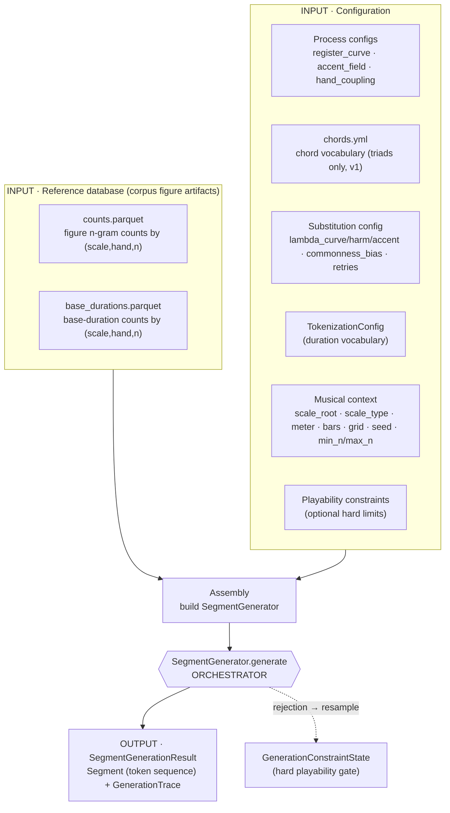
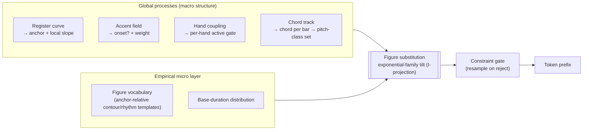
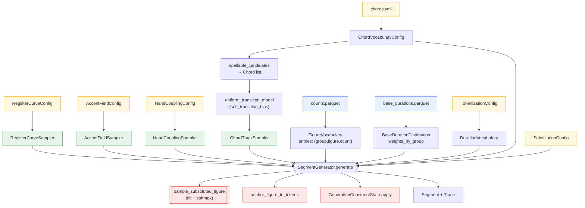
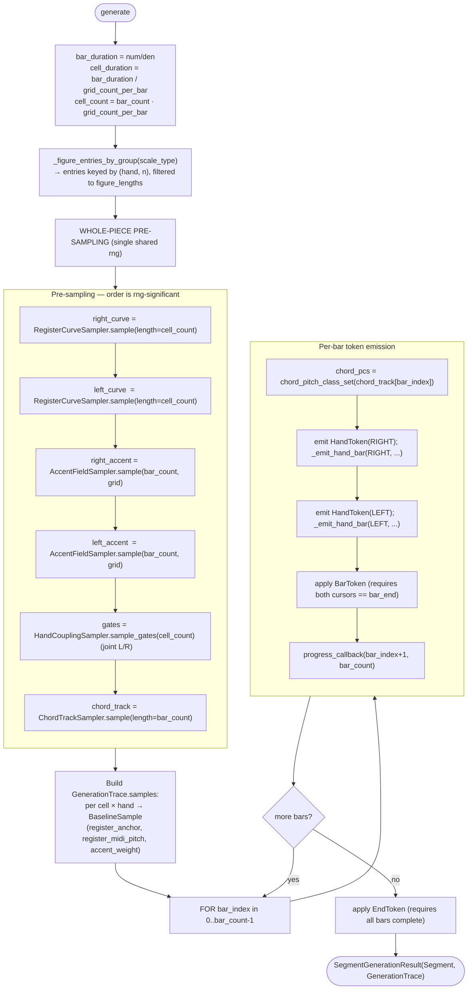
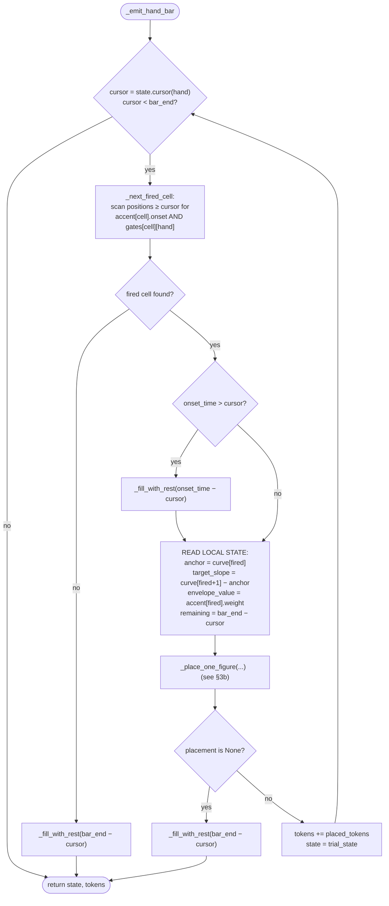
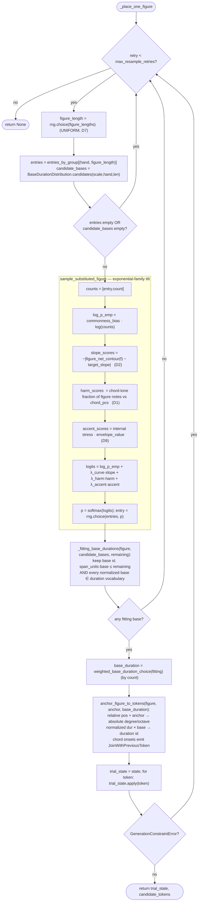
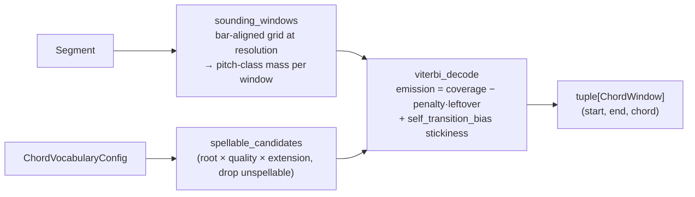

# Synthetic Generator — Procedural Model (from code)

> This document models the generator **as implemented** in `musak_model/synthetic/` and its
> direct dependencies, not as described in [`generator.md`](generator.md). Where the running
> code diverges from the design doc, the actual behaviour is described here and the divergences
> are collected in [§6](#6-where-the-code-diverges-from-generatormd). Every box maps to a concrete
> symbol; file/line references are given in [§7](#7-symbol-index).

The package is small (~2.3k LOC) and has a single orchestrator —
`SegmentGenerator.generate` (`musak_model/synthetic/substitution/generator.py:63`). Everything
else is either an **input** it consumes, a **sub-sampler** it calls, or the **calibration**
harness that wraps it. There are two real entry points:

- **Calibration sweep** — `calibration/calibrate.py` → `build_calibration_generator` → `run_sweep`.
- **Interactive notebook** — `notebooks/utils/synthetic.py:generate_synthetic_segment`, driven by
  the marimo app `notebooks/generator.py`.

Both assemble the same `SegmentGenerator`; they differ only in where the config values come from
(YAML files vs. notebook sliders) and in what they do with the output (TV-distance CSV vs. score /
piano-roll rendering).

---

## 1. Level 0 — High-level overview

The architecture is two layers meeting at one step. **Global low-order stochastic processes**
(register, accent, hand-coupling, chords) propose *absolute context per cell*; the **empirical
micro layer** (figure n-gram vocabulary + base-duration distribution, extracted from the corpus)
owns *local contour and rhythm*. They meet in the **figure-substitution** step, and every emitted
token prefix is gated by the **playability constraint engine** — the only hard rejection.

**Two layers, one meeting point:**

---

## 2. Level 1 — Unit composition

Each unit is an independent, separately-configured sampler with a clean input/output contract.
`generate` first runs the four global samplers **for the whole piece**, then walks bars/cells and
calls the substitution + emission + gate per fired onset.

### Unit contracts

| Unit | Input | Output | Core mechanism |
|---|---|---|---|
| **RegisterCurveSampler** `processes/pitch.py` | `length`, `rng` (+ config); **`scale_type`/`hand` are accepted but ignored**, see D4 | `tuple[int]` of length `length` — home-relative diatonic positions, one per cell | band-limited DCT **arch** `band_limited_random` + **OU residual** via `scipy.signal.lfilter`, summed and rounded |
| **AccentFieldSampler** `processes/accent.py` | `bar_count`, `grid_count_per_bar`, `rng` (+ config) | `tuple[AccentCell]` (`onset: bool`, `weight: float`) per cell | `logit = β₀ + g·ind(k)^γ + envelope`; `weight = expit(logit)`; `onset = U(0,1) < weight` |
| **HandCouplingSampler** `processes/hand_coupling.py` | `cell_count`, `rng` (+ config) | `tuple[dict[Hand,bool]]` — joint L/R active gate per cell | Gaussian copula, `ρ = 2·h_o − 1`, threshold `Φ⁻¹(1 − activityᵢ)` |
| **ChordTrackSampler** `processes/chord_track.py` | `length` (**= `bar_count`**, see D3), `rng`, `model` | `tuple[Chord]` (one chord per bar) | 1st-order Markov chain; model from `uniform_transition_model` |
| **FigureVocabulary** `figures.py` | `counts.parquet` | `entries: (group=(scale,hand,n), figure, count)` | loaded via `read_figure_counts`; grouped in generator by `(hand, n)` filtered to `scale_type` & `figure_lengths` |
| **BaseDurationDistribution** `base_durations.py` | `base_durations.parquet` | `weights_by_group[(scale,hand,n)] → [(Fraction,count)]` | `candidates(...)` returns per-group `(base_duration, count)` list |
| **Chord expansion** `harmony/expansion.py` | `Chord`, `scale_type`, `ChordVocabularyConfig` | `frozenset[int]` pitch classes | generic-third stacking `d_m=((d_r−1+2m) mod s)+1`, signed residue accidental |
| **Substitution sampler** `substitution/sampling.py` + `scoring.py` | `entries`, `anchor`, `target_slope`, `chord_pcs`, `envelope_value`, `config` | one `FigureVocabularyEntry` | `tilted_log_probabilities` (4 terms) → `softmax` → `rng.choice` |
| **Emission** `substitution/emission.py` | `figure`, `anchor`, `base_duration`, `scale_type`, `DurationVocabulary` | `list[Token]` (NoteToken + JoinWithPreviousToken for chord onsets) | anchors relative degrees to absolute, scales normalized durations by `base_duration` |
| **Constraint gate** `generation/constraints.py` | token + current state | next state, or `GenerationConstraintError` | immutable `GenerationConstraintState.apply`; reject → resample |
| **ViterbiChordDecoder** `harmony/decoding/` *(offline, not wired in — D5)* | `Segment` | `tuple[ChordWindow]` | sounding windows → spellable candidates → Viterbi with non-chord penalty |
| **Calibration sweep** `calibration/` | `CalibrationConfig`, reference counts | `SweepResult[]` → CSV | grid over (λ_curve,λ_harm,λ_accent); TV distance vs reference |

---

## 3. Level 2a — Detailed computation graph: pre-sampling + main loop

`generate(bar_count, time_numerator, time_denominator, grid_count_per_bar, scale_root, scale_type,
constraints, rng, source_file)` (`generator.py:63`):

### `_emit_hand_bar` — cursor walk over the sub-bar grid (`generator.py:231`)

A cell **fires** iff its accent is an onset **and** the hand-coupling gate is active for that hand.
Figures are placed **greedily, no lookahead** (acknowledged `NEEDS IMPROVEMENT` in the docstring):
once a figure fails to place, or no onset remains, the rest of the bar is filled with a single rest
and the hand-bar terminates.

`_fill_with_rest` (`generator.py:410`) maps a leftover `Fraction` to rest tokens: a direct
duration-vocabulary id if one exists, else a greedy largest-first decomposition; if it cannot sum
exactly it raises `GenerationConstraintError` (surfaced as a generation failure upstream).

---

## 3b. Level 2 — The substitution step (`_place_one_figure`, the I-projection)

This is the heart: where the global context tilts the empirical figure distribution, a base
duration is chosen, the figure is anchored to absolute tokens, and the result is gated. It retries
up to `max_resample_retries`.

**The four tilt terms (precise, from `scoring.py`):**

- `log_p_emp = commonness_bias · log(count)` ⟺ `p_emp(f) ∝ count^β` — flatten/sharpen the empirical frequencies.
- `slope_fit = −|figure_net_contour(f) − target_slope|`, where
  `figure_net_contour(f) = min(position for position,_ in f.onsets[-1][0])` — the **lowest note of
  the figure's final onset** (anchor-relative), i.e. an endpoint-displacement proxy, compared to the
  curve's **one-cell** forward slope. (Doc says "Σ relative steps"; see D2.)
- `harm_fit = (#figure note-instances whose pitch class ∈ chord_pcs) / (#note-instances)` — a flat
  chord-tone fraction. **No metrical-position weighting** (Doc's `H(f,C,m)`; see D1).
- `accent_fit = stress · envelope_value`, where
  `stress = Σ_i (durationᵢ/total)·(gcd(i, n)/n)` over onset **index** `i` — an intrinsic figure
  accent-shape, scaled by the cell's envelope weight (see D9).

The constraint gate (`GenerationConstraintState.apply`) enforces, per token: duration ≥ minimum and
dotted-allowed checks; remaining bar time; max notes per onset/hand; max same-hand pitch gap; max
onset span (semitones); max static hand span (scale degrees, requires `scale_type`); and the
structural rules (Bar requires both cursors filled; End requires all bars complete).

---

## 4. Level 2c — Offline chord decoding (present but not wired into generation)

The package ships a Viterbi chord decoder that recovers a chord-per-window labelling from a segment.
Its purpose (per the design) is to *fit* the chord transition matrix and the chord-conditioned
figure distribution — but **no code path feeds its output into `ChordTrackSampler` or into
`harm_fit`** (see D5). It runs standalone.

---

## 5. Data dictionary — inputs and intermediate representations

### 5.1 From the database (corpus figure artifacts)

Produced by figure extraction over the training corpus
(`parser.extract_hand_onset_runs` → `signature.iter_figure_occurrences_from_run` →
`counter.count_hand_figure_ngrams` → `profile/io.write_figure_counts`):

| Artifact | Schema | Loaded into | Used by |
|---|---|---|---|
| `counts.parquet` | `(scale_type, hand, n, count, figure-json)` | `FigureVocabulary.entries` | substitution candidate set + empirical prior `count^β` |
| `base_durations.parquet` | `(scale_type, hand, n, base_duration-ratio, count)` | `BaseDurationDistribution.weights_by_group` | reconstructing absolute time from normalized figure rhythm |

The canonical micro unit is **`FigureNGram`** (`n_grams/figure/schema.py`):
`onsets: tuple[(degrees, normalized_duration)]`, where `degrees = tuple[(relative_position,
accidental)]`. It is **anchor-relative** (first onset's lowest position subtracted to 0) and
**rhythm-normalized** (durations divided by the shortest onset). Properties `monophonic`,
`chords_only`, `in_scale` are derived but **not used to filter** the generation candidate set.

### 5.2 Representations the generator computes in

- **Diatonic lattice position** `p = octave·s + (degree−1)`, `s = scale_size_for_type(scale_type)`
  (= 7 for all three supported scales: major `(0,2,4,5,7,9,11)`, harmonic minor `(0,2,3,5,7,8,11)`,
  melodic minor `(0,2,3,5,7,9,11)`). Conversions: `note_diatonic_position`,
  `diatonic_position_to_degree_and_octave` (`tokens/pitch.py`).
- **Pitch class** `degree_pitch_class(degree, accidental) = (SCALE_INTERVALS[scale][degree−1] +
  accidental) mod 12` — used only for chord-membership tests in `harm_fit` and chord expansion.
- **Home register applied late**: the register curve is centered on 0; the hand home octave
  (`HAND_HOME_OCTAVES = {RIGHT: 5, LEFT: 3}`) is added only at `note_token_to_midi_pitch`.

### 5.3 From configuration

| Config (pydantic) | Source | Fields | Defaults (YAML) |
|---|---|---|---|
| `RegisterCurveConfig` | `register_curve.yml` / request | `arch_basis_count, arch_amplitude, arch_decay, ou_theta, ou_sigma` | `3, 4.0, 1.0, 0.2, 1.0` |
| `AccentFieldConfig` | `accent_field.yml` / request | `baseline_logit, metric_gain, metric_exponent, envelope_basis_count, envelope_amplitude, envelope_decay` | `−0.5, 2.0, 1.0, 3, 0.5, 1.0` |
| `HandCouplingConfig` | `hand_coupling.yml` / request | `co_activity_strength, activity_right, activity_left` | `0.7, 0.9, 0.9` |
| `ChordVocabularyConfig` | `chords.yml` | qualities (4 triads), extensions (triad only enabled) | seventh+ disabled (v1 triads) |
| `ChordDecoderConfig` | `chord_decoding.yml` | `resolution, self_transition_bias, non_chord_penalty` | `1 (per-bar), 0.25, 1.0` |
| `SubstitutionConfig` | request / sweep | `lambda_curve, lambda_harm, lambda_accent, commonness_bias, max_resample_retries` | request-driven |
| `GenerationConstraints` | request | meter, bars, + optional `minimum_duration, allow_dotted, max_notes_per_hand, max_onset_span, max_gap, max_static_span, scale_root/type` | — |
| `CalibrationConfig` | `calibration.yml` | figure_root, meter, bars, samples, min_n/max_n, λ grids, seed | major 4/4, 16 bars, 64 samples, n∈[2,4], λ∈{0,.1,.25,.5,1} |
| `TokenizationConfig` | model config | shortest duration, allowed tuplets, max dots → `DurationVocabulary` | — |

### 5.4 Generation-time scalars

`bar_count`, `time_numerator/denominator`, `grid_count_per_bar`, `scale_root`, `scale_type`,
`seed` (→ `numpy.random.default_rng`), `min_n`/`max_n` (→ `figure_lengths`).

---

## 6. Where the code diverges from `generator.md`

These are the points where the **running procedure** differs from the design document — relevant
because the model above is built from the code, not the prose.

- **D1 — Harmonic fit has no metrical weighting.** `harm_fit` (`scoring.py:21`) is a flat
  chord-tone fraction; it takes no metrical position `m`. The doc's `H(f, C, m)` ("chord tones
  rewarded on strong beats, NCTs favoured on weak beats between chord tones") is not implemented.
- **D2 — Slope fit uses an endpoint proxy, not Σ steps, against a one-cell slope.**
  `figure_net_contour` returns the lowest relative position of the figure's **last onset**; the doc
  defines it as the sum of relative steps. It is compared to `curve[fired+1] − curve[fired]`, a
  single-cell difference, so the two quantities live on different scales.
- **D3 — Harmonic rhythm is fixed at one chord per bar.** `chord_track` is sampled with
  `length=bar_count` and applied once per bar (`generator.py:116,151`). The configurable
  whole/half/quarter harmonic-rhythm resolution exists only on the offline decoder
  (`ChordDecoderConfig.resolution`); generation has no sub-bar chord windowing.
- **D4 — Register curve is hand- and scale-agnostic.** `RegisterCurveSampler.sample` explicitly
  discards `scale_type` and `hand` (`pitch.py:49`, `_ = scale_type, hand`). Both hands draw i.i.d.
  from one shared `RegisterCurveConfig`; the only L/R difference is the home octave added at MIDI
  conversion. No per-`(scale_type, hand)` OU/arch parameters.
- **D5 — Fitting/calibration loop is not closed in code.** The moment-matched OU/arch/accent params
  (doc §9) are hand-set YAML, not fit from the corpus. `ViterbiChordDecoder` exists but its output
  (transition matrix, chord-conditioned figure distribution) is never consumed by
  `ChordTrackSampler` (always `uniform_transition_model`) nor by `harm_fit`. The decode→generate
  seam is open.
- **D6 — λ selection is manual.** `run_sweep` writes a TV-distance CSV over the full λ grid; the
  "largest tilt below threshold 0.1" selection rule (doc §9) is not coded — it is left to
  inspection of the CSV.
- **D7 — Figure length is uniform, not empirical.** `_place_one_figure` picks `figure_length` via
  `rng.choice(figure_lengths)` uniformly (`generator.py:347`). `FigureVocabulary.length_distribution`
  exists but is unused on the hot path.
- **D8 — Monorhythmic filtering is dead on the hot path.** `monorhythmic_entries` / `is_monorhythmic`
  exist but `generate` draws from **all** figures in `(hand, n)` (including polyrhythmic and chord
  figures, which emit `JoinWithPreviousToken`).
- **D9 — Accent fit's "metrical" weight is over onset *index*, not bar grid position.** `accent_fit`
  uses `gcd(i, n)/n` over the onset's index within the figure. The bar's
  `gcd(k, M)/M` indispensability is used only in the accent-**field** logits, not in the
  substitution accent score.
- **D10 — Two commonness-bias implementations.** `FigureVocabulary.sample` tilts by `count^β` but is
  unused in generation; the live path uses `tilted_log_probabilities` with the equivalent
  `β·log(count)`.

---

## 7. Symbol index

| Concept | Symbol · location |
|---|---|
| Orchestrator | `SegmentGenerator.generate` — `substitution/generator.py:63` |
| Per-hand bar fill | `SegmentGenerator._emit_hand_bar` — `generator.py:231` |
| Substitution + gate loop | `SegmentGenerator._place_one_figure` — `generator.py:332` |
| Base-duration fit | `SegmentGenerator._fitting_base_durations` — `generator.py:388` |
| Tilt / softmax sampler | `sample_substituted_figure`, `tilted_log_probabilities` — `substitution/sampling.py` |
| Tilt terms | `slope_fit`, `harm_fit`, `accent_fit`, `figure_net_contour` — `substitution/scoring.py` |
| Token emission | `anchor_figure_to_tokens` — `substitution/emission.py` |
| Register curve | `RegisterCurveSampler` — `processes/pitch.py`; `band_limited_random` — `processes/_basis.py` |
| Accent field | `AccentFieldSampler` — `processes/accent.py` |
| Hand coupling | `HandCouplingSampler` — `processes/hand_coupling.py` |
| Chord track | `ChordTrackSampler`, `uniform_transition_model` — `processes/chord_track.py` |
| Chord → pitch classes | `chord_pitch_class_set`, `expand_chord_to_tones` — `harmony/expansion.py` |
| Chord vocabulary | `ChordVocabularyConfig` — `harmony/vocabulary.py`; `Chord` — `harmony/schema.py` |
| Chord decoder (offline) | `ViterbiChordDecoder` — `harmony/decoding/decoder.py`; `sounding_windows`, `viterbi_decode`, `spellable_candidates` |
| Figure vocabulary | `FigureVocabulary` — `synthetic/figures.py`; `FigureNGram` — `n_grams/figure/schema.py` |
| Base durations | `BaseDurationDistribution` — `synthetic/base_durations.py` |
| Playability gate | `GenerationConstraintState`, `GenerationConstraints` — `generation/constraints.py` |
| Calibration | `calibrate`, `run_sweep`, `build_calibration_generator` — `synthetic/calibration/` |
| TV-distance metric | `figure_distribution_metrics` — `n_grams/profile/metrics/distribution.py` |
| Assembly (notebook) | `generate_synthetic_segment`, `SyntheticInputs` — `notebooks/utils/synthetic.py` |
| Trace | `GenerationTrace`, `BaselineSample` — `substitution/trace.py` |
