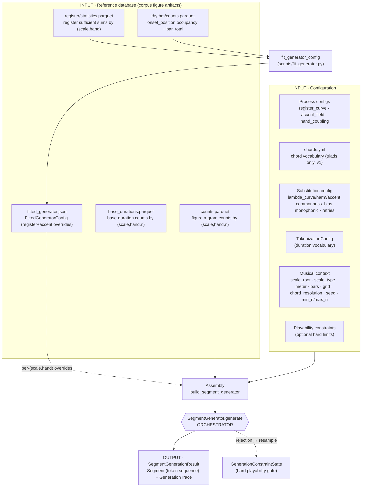
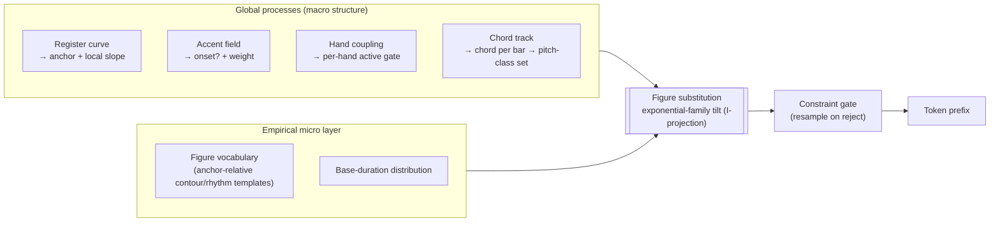
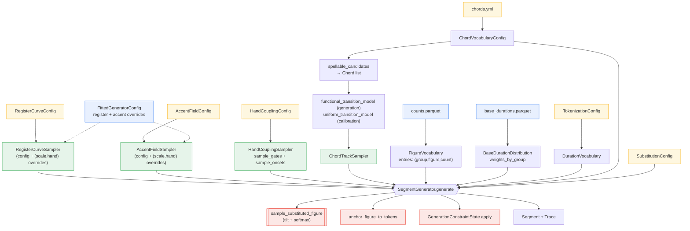
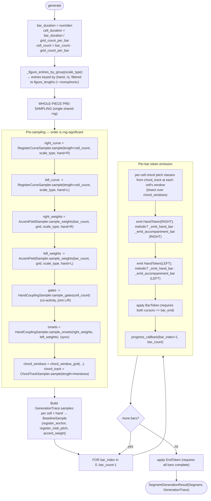
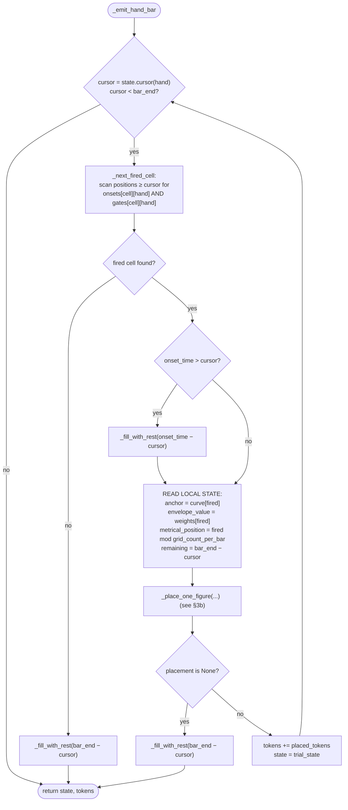
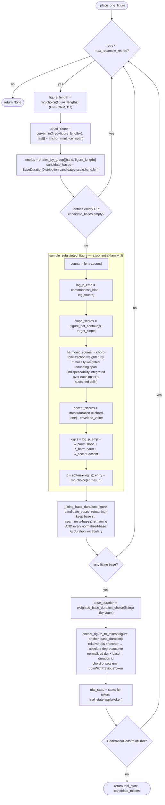
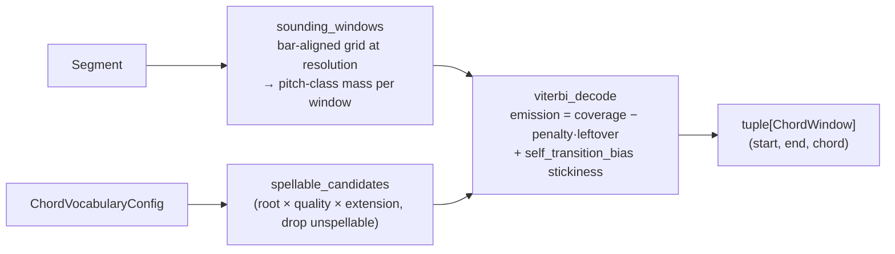

# Synthetic Generator — Procedural Model (from code)

> This document models the generator **as implemented** in `musak_model/synthetic/` and its
> direct dependencies, not as described in [`overview.md`](overview.md). Where the running
> code diverges from the design doc, the actual behaviour is described here and the divergences
> are collected in [§7](#7-where-the-code-diverges-from-generatormd). Every box maps to a concrete
> symbol; file/line references are given in [§8](#8-symbol-index).

The package has a single orchestrator — `SegmentGenerator.generate`
(`musak_model/synthetic/substitution/generator.py:67`). Everything else is either an **input** it
consumes, a **sub-sampler** it calls, the **fitting** machinery that produces its per-`(scale_type, hand)`
overrides, or the **calibration** harness that wraps it. There are three real entry points:

- **Calibration sweep** — `calibration/calibrate.py` → `build_calibration_generator` → `run_sweep`.
- **Interactive notebook** — `notebooks/utils/synthetic.py:generate_synthetic_segment`, driven by
  the marimo app `notebooks/generator.py`.
- **Generator fitting** — `scripts/fit_generator.py` (`make fit-generator`) →
  `synthetic/fitting/fit.py:fit_generator_config`, which reads persisted corpus statistics and writes a
  `FittedGeneratorConfig` artifact (`fitted_generator.json`) that generation loads (§6).

Calibration and the notebook both assemble the same `SegmentGenerator` through one factory
(`synthetic/builder.py:build_segment_generator`); they differ in where config values come from (YAML files
vs. notebook sliders), what chord prior they use (calibration: uniform; notebook: functional, §2), and what
they do with the output (TV-distance CSV vs. score / piano-roll rendering). The register and accent process
parameters are **fit from persisted corpus statistics** and loaded as per-`(scale_type, hand)` overrides
(§6); without a fitted artifact, generation falls back to the default config.

---

## 1. Level 0 — High-level overview

The architecture is two layers meeting at one step. **Global low-order stochastic processes**
(register, accent, hand-coupling, chords) propose *absolute context per cell*; the **empirical
micro layer** (figure n-gram vocabulary + base-duration distribution, extracted from the corpus)
owns *local contour and rhythm*. They meet in the **figure-substitution** step, and every emitted
token prefix is gated by the **playability constraint engine** — the only hard rejection.

**Two layers, one meeting point:**

---

## 2. Level 1 — Unit composition

Each unit is an independent, separately-configured sampler with a clean input/output contract.
`generate` first runs the global samplers **for the whole piece** — register curve, accent **weights**,
hand-coupling **gates + onset masks**, and chord track — then walks bars/cells and calls the substitution +
emission + gate per fired onset. The per-cell onset *decision* lives in `HandCouplingSampler.sample_onsets`
(it owns both co-activity and sync), not in the accent sampler, which now yields weights only.

### Unit contracts

| Unit | Input | Output | Core mechanism |
|---|---|---|---|
| **RegisterCurveSampler** `processes/pitch.py` | `length`, `scale_type`, `hand`, `rng`; `config` + `overrides: tuple[RegisterCurveOverride,…]` keyed by `(scale_type, hand)` (`_config_for`, default fallback) | `tuple[int]` of length `length` — home-relative diatonic positions, one per cell | band-limited DCT **arch** `band_limited_random` + **OU residual** via `scipy.signal.lfilter`, summed and rounded |
| **AccentFieldSampler** `processes/accent.py` | `bar_count`, `grid_count_per_bar`, `scale_type`, `hand`, `rng`; `config` + `(scale,hand)` overrides | `tuple[float]` — per-cell weight (no `AccentCell`; the onset draw moved to hand coupling) | `logit = β₀ + β₁·ind(k)^γ + envelope`; `weight = expit(logit)`; `ind` via public `indispensability_per_position` |
| **HandCouplingSampler** `processes/hand_coupling.py` | `cell_count`, `rng` (+ config) → `sample_gates`; `right_weights`, `left_weights`, `rng` → `sample_onsets` | gates: `tuple[dict[Hand,bool]]` (co-activity); onsets: `tuple[dict[Hand,bool]]` (per-cell Bernoulli at the accent weight, shared-uniform with prob `sync_strength`) | co-activity: Gaussian copula `ρ = 2·h_o − 1`, threshold `Φ⁻¹(1 − activityᵢ)`; **sync**: shared vs independent uniform draw |
| **ChordTrackSampler** `processes/chord_track.py` | `length` (**= chord-window count from `chord_resolution`**), `rng`, `model` | `tuple[Chord]` (one chord per window) | 1st-order Markov chain; model from `functional_transition_model` (generation) or `uniform_transition_model` (calibration) |
| **FigureVocabulary** `figures.py` | `counts.parquet` | `entries: (group=(scale,hand,n), figure, count)` | loaded via `read_figure_counts`; grouped in generator by `(hand, n)` filtered to `scale_type` & `figure_lengths` |
| **BaseDurationDistribution** `base_durations.py` | `base_durations.parquet` | `weights_by_group[(scale,hand,n)] → [(Fraction,count)]` | `candidates(...)` returns per-group `(base_duration, count)` list |
| **Chord expansion** `harmony/expansion.py` | `Chord`, `scale_type`, `ChordVocabularyConfig` | `frozenset[int]` pitch classes | generic-third stacking `d_m=((d_r−1+2m) mod s)+1`, signed residue accidental |
| **Substitution sampler** `substitution/sampling.py` + `scoring.py` | `entries`, `anchor`, `target_slope`, `chord_pcs`, `chord`, `figure_by_chord_model`, `envelope_value`, `metrical_position`, `grid_count_per_bar`, `config` | one `FigureVocabularyEntry` | `tilted_log_probabilities` (5 terms; harmonic + accent chord-/metric-aware §3b, plus the empirical `λ_chord_figure·log p(figure∣C)` term) → `softmax` → `rng.choice` |
| **Emission** `substitution/emission.py` | `figure`, `anchor`, `base_duration`, `scale_type`, `DurationVocabulary` | `list[Token]` (NoteToken + JoinWithPreviousToken for chord onsets) | anchors relative degrees to absolute, scales normalized durations by `base_duration` |
| **Constraint gate** `generation/constraints.py` | token + current state | next state, or `GenerationConstraintError` | immutable `GenerationConstraintState.apply`; reject → resample |
| **ViterbiChordDecoder** `harmony/decoding/` *(run in the corpus fitting pass — §6)* | `Segment` | `tuple[ChordWindow]` | sounding windows → spellable candidates → Viterbi with non-chord penalty |
| **Calibration sweep** `calibration/` | `CalibrationConfig`, reference counts | `SweepResult[]` → CSV | grid over (λ_curve,λ_harm,λ_accent); TV distance vs reference |

---

## 3. Level 2a — Detailed computation graph: pre-sampling + main loop

`generate(*, bar_count, time_numerator, time_denominator, grid_count_per_bar, chord_resolution, scale_root,
scale_type, constraints, rng, source_file, progress_callback)` (`generator.py:67`):

### `_emit_hand_bar` — cursor walk over the sub-bar grid (`generator.py:231`)

A cell **fires** iff its coupled **onset mask** (`onsets[cell][hand]`, from `sample_onsets`) **and** its
**co-activity gate** (`gates[cell][hand]`) are both active for that hand.
Figures are placed **greedily, no lookahead** (acknowledged `NEEDS IMPROVEMENT` in the docstring):
once a figure fails to place, or no onset remains, the rest of the bar is filled with a single rest
and the hand-bar terminates.

`_fill_with_rest` (`generator.py`) maps a leftover `Fraction` to rest tokens via `_duration_pieces`: a direct
duration-vocabulary id if one exists, else a greedy largest-first decomposition; if it cannot sum
exactly it raises `GenerationConstraintError` (surfaced as a generation failure upstream).

**Accompaniment textures.** When `SubstitutionConfig.texture` marks a hand non-melodic
(`substitution/texture.py`: `BLOCK_CHORD` / `SUSTAINED_BASS`), that hand runs `_emit_accompaniment_bar` instead:
the bar is split into maximal runs of one decoded chord, and per run the chord is voiced in close position from
the register-curve anchor (`emission.chord_window_tokens`, reusing `expand_chord_to_tones`) and held for the run
(`BLOCK_PER_WINDOW`, decomposing odd windows into a chord attack + `HoldToken`s via `_duration_pieces`) or
re-attacked on the run's accent onsets (`ACCENT_GATED`); `SUSTAINED_BASS` voices the root only. Each voicing is
pushed through the constraint engine, dropping the top tone then resting on rejection. The default
`ALL_MELODIC_TEXTURE` leaves both hands on the figure path, so this is inert unless opted into at generation.

---

## 3b. Level 2 — The substitution step (`_place_one_figure`, the I-projection)

This is the heart: where the global context tilts the empirical figure distribution, a base
duration is chosen, the figure is anchored to absolute tokens, and the result is gated. It retries
up to `max_resample_retries`.

**The four tilt terms (precise, from `scoring.py`):**

- `log_p_emp = commonness_bias · log(count)` ⟺ `p_emp(f) ∝ count^β` — flatten/sharpen the empirical frequencies.
- `slope_fit = −|figure_net_contour(f) − target_slope|`, where
  `figure_net_contour(f) = min(position for position,_ in f.onsets[-1][0])` — the net displacement of the
  figure's **lowest voice** (anchor-relative), compared to the register curve's change over the figure's
  **multi-cell span** `target_slope = curve[min(fired+figure_length−1, last)] − anchor` (one cell per onset),
  so the two live on the same scale.
- `harmonic_fit` — the chord-tone fraction weighted by each onset's **metrically-weighted sounding span**: the
  figure is laid on cells proportional to its normalized durations (cumulative `start_cell`), and each onset's
  weight is `gcd(position, M)/M` **integrated over every cell it sustains through** (`metrical_weight_over_span`
  in `processes/accent.py`, reusing `indispensability_per_position`), so a long note struck on a weak cell but
  held across a strong beat accrues that beat's weight. Reduces to the old per-onset weighting when all
  durations are equal, and to the flat fraction at `grid_count_per_bar = 1`. Threads `metrical_position` +
  `grid_count_per_bar` from `_place_one_figure`.
- `accent_fit = stress · envelope_value`, where `stress` blends two emphases at the figure's internal strong
  points `gcd(i, n)/n`: the duration weight and a chord-tone-onset weight (falling back to duration-only when
  the figure has no chord tones). `envelope_value` remains a flat per-cell multiplier (the design's envelope
  `λ_i(k)` is per-cell, so the figure shape can only be *scaled* by it).

The constraint gate (`GenerationConstraintState.apply`) enforces, per token: duration ≥ minimum and
dotted-allowed checks; remaining bar time; max notes per onset/hand; max same-hand pitch gap; max
onset span (semitones); max static hand span (scale degrees, requires `scale_type`); and the
structural rules (Bar requires both cursors filled; End requires all bars complete).

---

## 4. Level 2c — Chord decoding (corpus fitting input)

The package ships a Viterbi chord decoder (`musak_model/harmony/decoding/`, a neutral package importable by
both the n-grams figure pass and synthetic) that recovers a chord-per-window labelling from a segment. It is
**run over the corpus in the figure-profile pass** to fit the empirical chord transition matrix and the
chord-conditioned figure distribution `p(figure | C)` — see §6, which now covers all three fitting halves
(register, accent, chord). It is not used at generation time itself; generation consumes the *baked* fit.

---

## 5. Data dictionary — inputs and intermediate representations

### 5.1 From the database (corpus figure artifacts)

Produced by figure extraction over the training corpus
(`parser.extract_hand_onset_runs` → `signature.iter_figure_occurrences_from_run` →
`counter.count_hand_figure_ngrams` → `profile/io.write_figure_counts`):

| Artifact | Schema | Loaded into | Used by |
|---|---|---|---|
| `all/counts.parquet` | `(scale_type, hand, n, count, figure-json)` | `FigureVocabulary.entries` | substitution candidate set + empirical prior `count^β` |
| `all/base_durations.parquet` | `(scale_type, hand, n, base_duration-ratio, count)` | `BaseDurationDistribution.weights_by_group` | reconstructing absolute time from normalized figure rhythm |
| `rhythm/counts.parquet` (`onset_position`, `bar_total` kinds) | `(scale_type, time_signature, hand, kind, parameter=grid-denominator, value=cell, count)` | `RhythmCountCounter` | **accent fitting** — per-cell occupancy + bar denominator (§6) |
| `register/statistics.parquet` (+ `register/metadata.json`) | `(scale_type, hand)` → `(trend²-sum, residual²-sum, residual·lag-sum, n)`; metadata `arch_basis_count` | `RegisterStatistics` | **register fitting** — sufficient sums (§6) |
| `chord/transitions.parquet` | `(scale_type, source_chord, destination_chord, count)` (initial = sentinel source) | `ChordTransitionCounts` | **chord fitting** — empirical transition matrix (§6) |
| `chord/figure_by_chord.parquet` (+ `chord/metadata.json`) | `(scale_type, hand, n, chord, figure-json, count)`; metadata = `ChordDecoderConfig` | `FigureByChordCounts` | **chord fitting** — `p(figure ∣ C)` (§6) |
| `all/fitted_generator.json` | `FittedGeneratorConfig` (register + accent overrides, per-scale-type chord transitions, figure-by-chord log-probs) | `FittedGeneratorConfig` | per-`(scale,hand)` overrides + baked chord models into the samplers/tilt (§6) |

The canonical micro unit is **`FigureNGram`** (`n_grams/figure/schema.py`):
`onsets: tuple[(degrees, normalized_duration)]`, where `degrees = tuple[(relative_position,
accidental)]`. It is **anchor-relative** (first onset's lowest position subtracted to 0) and
**rhythm-normalized** (durations divided by the shortest onset). Properties `monophonic`,
`chords_only`, `in_scale` are derived; `monophonic` **is used to filter** the candidate set when
`SubstitutionConfig.monophonic` is set (the generation/notebook default; calibration leaves it off).

### 5.2 Representations the generator computes in

- **Diatonic lattice position** `p = octave·s + (degree−1)`, `s = scale_size_for_type(scale_type)`
  (= 7 for all three supported scales: major `(0,2,4,5,7,9,11)`, harmonic minor `(0,2,3,5,7,8,11)`,
  melodic minor `(0,2,3,5,7,9,11)`). Conversions: `note_diatonic_position`,
  `diatonic_position_to_degree_and_octave` (`tokens/pitch.py`).
- **Pitch class** `degree_pitch_class(degree, accidental) = (SCALE_INTERVALS[scale][degree−1] +
  accidental) mod 12` — used only for chord-membership tests in `harmonic_fit` and chord expansion.
- **Home register applied late**: the register curve is centered on 0; the hand home octave
  (`HAND_HOME_OCTAVES = {RIGHT: 5, LEFT: 3}`) is added only at `note_token_to_midi_pitch`.

### 5.3 From configuration

| Config (pydantic) | Source | Fields | Defaults (YAML) |
|---|---|---|---|
| `RegisterCurveConfig` | `register_curve.yml` / request | `arch_basis_count, arch_amplitude, arch_decay, ou_theta, ou_sigma` | `3, 4.0, 1.0, 0.2, 1.0` |
| `AccentFieldConfig` | `accent_field.yml` / request | `baseline_logit, metric_gain, metric_exponent, envelope_basis_count, envelope_amplitude, envelope_decay` | `−0.5, 2.0, 1.0, 3, 0.5, 1.0` |
| `HandCouplingConfig` | `hand_coupling.yml` / request | `co_activity_strength, activity_right, activity_left, sync_strength` | `0.7, 0.9, 0.9, 0.0` |
| `ChordVocabularyConfig` | `chords.yml` | qualities (4 triads), extensions (triad only enabled) | seventh+ disabled (v1 triads) |
| `ChordDecoderConfig` | `chord_decoding.yml` | `resolution, self_transition_bias, non_chord_penalty` | `1 (per-bar), 0.25, 1.0` |
| `SubstitutionConfig` | request / sweep | `lambda_curve, lambda_harmonic, lambda_accent, commonness_bias, max_resample_retries, monophonic` | request-driven (notebook default `monophonic=True`; calibration `False`) |
| `GenerationConstraints` | request | meter, bars, + optional `minimum_duration, allow_dotted, max_notes_per_hand, max_onset_span, max_gap, max_static_span, scale_root/type` | — |
| `CalibrationConfig` | `calibration.yml` | figure_root, meter, bars, samples, min_n/max_n, `chord_resolution`, `self_transition_bias`, λ grids, `target_total_variation_distance`, seed | major 4/4, 16 bars, 64 samples, n∈[2,4], chord_resolution 1, λ∈{0,.1,.25,.5,1}, TV target 0.1 |
| `NGramAnalysisConfig` *(corpus pass)* | `analysis/n_grams.yml` | sub-configs `figure{min_n,max_n,limit_per_group,common_mass_threshold}`, `rhythm{min_n,max_n,grid_alignment_denominators,strong_beat_offsets}`, `register{arch_basis_count}`, `execution{workers,batch_size}` — all required | `arch_basis_count` matches `register_curve.yml` (3) |
| `FittedGeneratorConfig` *(fit artifact)* | `all/fitted_generator.json` | `register_overrides: tuple[RegisterCurveOverride]`, `accent_overrides: tuple[AccentFieldOverride]` | empty when absent |
| `TokenizationConfig` | model config | shortest duration, allowed tuplets, max dots → `DurationVocabulary` | — |

### 5.4 Generation-time scalars

`bar_count`, `time_numerator/denominator`, `grid_count_per_bar`, `chord_resolution`, `scale_root`,
`scale_type`, `seed` (→ `numpy.random.default_rng`), `min_n`/`max_n` (→ `figure_lengths`).

---

## 6. The fitting loop (corpus statistics → `FittedGeneratorConfig`)

The register, accent **and chord** process parameters are **fit from persisted corpus statistics**, not
hand-set and not recomputed at fit time. Three stages:

**(a) Persisted statistics — produced once by the figure-profile corpus pass.** The same streaming pass that
counts figures also accumulates, per batch and additively-merged:
- **Register sufficient sums** (`n_grams/profile/register/`): per `(scale_type, hand)`, the running sums
  `Σtrend²`, `Σresidual²`, `Σresidual·residual_lag`, `n`, where each onset-register sequence is split into a
  slow **trend** and a fast **residual** by the **mid-cell DCT basis the arch sampler uses**
  (`register/dct.py:trend_and_residual`) — so arch and OU never double-count variance. The order
  (`arch_basis_count`) is recorded in `register/metadata.json`.
- **Accent occupancy** (`rhythm/counts.parquet`, kinds `onset_position` + `bar_total`): per
  `(scale_type, time_signature, hand)` and grid denominator, the **binary occupancy** of each within-bar cell
  (how many bars fire an onset there) plus the **bar total** (the denominator). `extract_hand_onset_runs`
  feeds both this and the register sums.
- **Chord counts** (`chord/transitions.parquet` + `chord/figure_by_chord.parquet`): the
  `ViterbiChordDecoder` decodes each reconstructed segment, accumulating **transition counts** keyed by
  `(scale_type, source_chord, destination_chord)` (the initial chord folded in under a sentinel source) and
  **figure-by-chord counts** keyed by `(scale_type, hand, n, chord, figure)` (the chord covering each
  figure's first onset). The decode is confined to the durable reference pass (the transient split pass stays
  decode-free) and `chord/metadata.json` records the `ChordDecoderConfig`.

The streaming pipeline (`profile/streaming/`) carries these through `FigureBatchTask`/`FigureBatchResult`,
sums them in SQLite (additive upserts), and exports the parquet/metadata. The work-store **state key**
includes `register_arch_basis_count`, the `ChordDecoderConfig` and the chord vocabulary, so changing any of
them forces a fresh build.

**(b) Fitters (`synthetic/fitting/`) — read statistics, emit overrides.**
- `register.py:register_moments_from_statistics` reduces the sums → `RegisterMoments` (trend std, residual
  std, lag-1 autocorrelation); `fit_register_config` maps them to a `RegisterCurveConfig`
  (`θ = 1−ρ`, `σ = std·√(2θ−θ²)`, arch amplitude from the band-limited variance).
- `accent.py:accent_moments_from_rhythm_counts` pools the occupancy by metrical **indispensability**
  `gcd(k,M)/M` (reusing the generator's `indispensability_per_position`) across time signatures, giving a
  per-level occupancy rate with a bar-count weight; `fit_accent_config` does a **3-parameter weighted fit** of
  `logit(rate)` on `indispensability^exponent` → `baseline_logit`, `metric_gain`, and a **fitted
  `metric_exponent`** (chosen by a small exponent search). The accent **envelope** parameters
  (`envelope_*`) stay pass-through (fitting deferred).
- `chord.py:fit_chord_transition_model` Dirichlet-smooths each empirical transition row toward the functional
  prior (`prior_count`; an unobserved source backs off exactly to the prior), per scale type;
  `fit_figure_by_chord` normalizes the figure-by-chord counts to per-`(scale, hand, n, chord)`
  `log p(figure | C)`. Both fit-time knobs (`prior_count`, the prior's `functional_strength` /
  `self_transition_bias`) come from `ChordFitConfig` (`chord_fit.yml`).

**(c) Persist + load.** `fit.py:fit_generator_config(figure_root, register_default, accent_default,
chord_fit, chord_vocabulary, grid_denominator)` reads the register + rhythm + chord artifacts (validating
`arch_basis_count`) and returns a `FittedGeneratorConfig`. `scripts/fit_generator.py` (`make fit-generator`)
writes it as `fitted_generator.json` into the **`all/`** directory (next to the figure vocabulary). The chord
models are **baked into that JSON** with string chord keys (`Chord.model_dump_json`, since pydantic does not
round-trip model-keyed dicts): per-scale-type `FittedChordTransitions` and a `FittedFigureByChord`. At
generation, `notebooks/utils/synthetic.py:load_synthetic_inputs` finds the artifact via
`artifacts.py:resolve_fitted_generator_config_path` — which probes `path/`, `path/all/`, and
`path/figure/all/`, exactly like the figure-counts resolver — and passes the register/accent overrides, the
`figure_by_chord_model`, and (when `chord_model="empirical"`) the per-scale-type transition model to
`build_segment_generator`; absent the artifact it falls back to empty overrides / the functional prior
(default config).

---

## 7. Where the code diverges from `overview.md`

The model body above describes the code as-built; most earlier divergences are now closed and folded into
the body. One genuine divergence from the design remains:

- **D7 — Figure length is uniform, not empirical.** `_place_one_figure` picks `figure_length` via
  `rng.choice(figure_lengths)` uniformly. `FigureVocabulary.length_distribution` exists but is unused on the
  hot path. (See `followups.md` #7.)

(The previously-tracked D1–D6 and D8–D10 are closed; their current behavior is described in §2–§3b and §6.
D5's last piece — the empirical chord loop — is now closed and wired: the decoder runs in the corpus pass,
its transition + figure-by-chord counts are persisted and fit into the baked chord models, and generation
consumes them via the `chord_model` selector and the `lambda_chord_figure` tilt, §6.)

---

## 8. Symbol index

| Concept | Symbol · location |
|---|---|
| Orchestrator | `SegmentGenerator.generate` — `substitution/generator.py:67` |
| Per-hand bar fill | `SegmentGenerator._emit_hand_bar` — `generator.py` |
| Substitution + gate loop | `SegmentGenerator._place_one_figure` — `generator.py` |
| Base-duration fit | `SegmentGenerator._fitting_base_durations` — `generator.py` |
| Assembly factory | `build_segment_generator` — `synthetic/builder.py` |
| Tilt / softmax sampler | `sample_substituted_figure`, `tilted_log_probabilities` — `substitution/sampling.py` |
| Tilt terms | `slope_fit`, `harmonic_fit`, `accent_fit`, `figure_net_contour` — `substitution/scoring.py` |
| Token emission | `anchor_figure_to_tokens`, `chord_window_tokens` — `substitution/emission.py` |
| Texture mode | `HandTexture`, `AccompanimentRhythm`, `HandTextureConfig`, `ALL_MELODIC_TEXTURE` — `substitution/texture.py`; `_emit_accompaniment_bar` — `substitution/generator.py` |
| Register curve | `RegisterCurveSampler`, `RegisterCurveOverride` — `processes/pitch.py`; `band_limited_random` — `processes/_basis.py` |
| Accent field | `AccentFieldSampler`, `AccentFieldOverride`, `indispensability_per_position` — `processes/accent.py` |
| Hand coupling | `HandCouplingSampler` (`sample_gates`, `sample_onsets`) — `processes/hand_coupling.py` |
| Chord track | `ChordTrackSampler`, `functional_transition_model`, `uniform_transition_model` — `processes/chord_track.py` |
| Chord windows | `chord_window_grid` — `synthetic/harmony/windows.py` |
| Chord → pitch classes | `chord_pitch_class_set`, `expand_chord_to_tones` — `harmony/expansion.py` |
| Chord vocabulary | `ChordVocabularyConfig` — `harmony/vocabulary.py`; `Chord` — `harmony/schema.py` |
| Chord decoder (offline) | `ViterbiChordDecoder` — `harmony/decoding/decoder.py`; `sounding_windows`, `viterbi_decode`, `spellable_candidates` |
| Figure vocabulary | `FigureVocabulary` — `synthetic/figures.py`; `FigureNGram` — `n_grams/figure/schema.py` |
| Base durations | `BaseDurationDistribution` — `synthetic/base_durations.py` |
| Register statistics (corpus) | `register_statistics`, `RegisterStatistics`, `RegisterProfileMetadata` — `n_grams/profile/register/{extraction,schema,io}.py`; `trend_and_residual` — `register/dct.py` |
| Accent occupancy (corpus) | `onset_position` / `bar_total` kinds — `n_grams/profile/rhythm/extraction.py`, `rhythm/schema.py` |
| Register fitter | `register_moments_from_statistics`, `fit_register_overrides_from_statistics` — `synthetic/fitting/register.py` |
| Accent fitter | `accent_moments_from_rhythm_counts`, `fit_accent_config` — `synthetic/fitting/accent.py` |
| Fit entry / artifact | `fit_generator_config` — `synthetic/fitting/fit.py`; `FittedGeneratorConfig`, `resolve_fitted_generator_config_path` — `synthetic/fitting/artifacts.py`; `scripts/fit_generator.py` |
| Playability gate | `GenerationConstraintState`, `GenerationConstraints` — `generation/constraints.py` |
| Calibration | `calibrate`, `run_sweep`, `build_calibration_generator`, `select_tilts` — `synthetic/calibration/` |
| TV-distance metric | `figure_distribution_metrics` — `n_grams/profile/metrics/distribution.py` |
| Musical metrics (Stage 0) | `musical_metrics`, `musical_profile_metrics` — `evaluation/musical.py`, `evaluation/generation/musical_metrics.py` |
| Assembly (notebook) | `generate_synthetic_segment`, `SyntheticInputs`, `load_synthetic_inputs` — `notebooks/utils/synthetic.py` |
| Trace | `GenerationTrace`, `BaselineSample` — `substitution/trace.py` |
