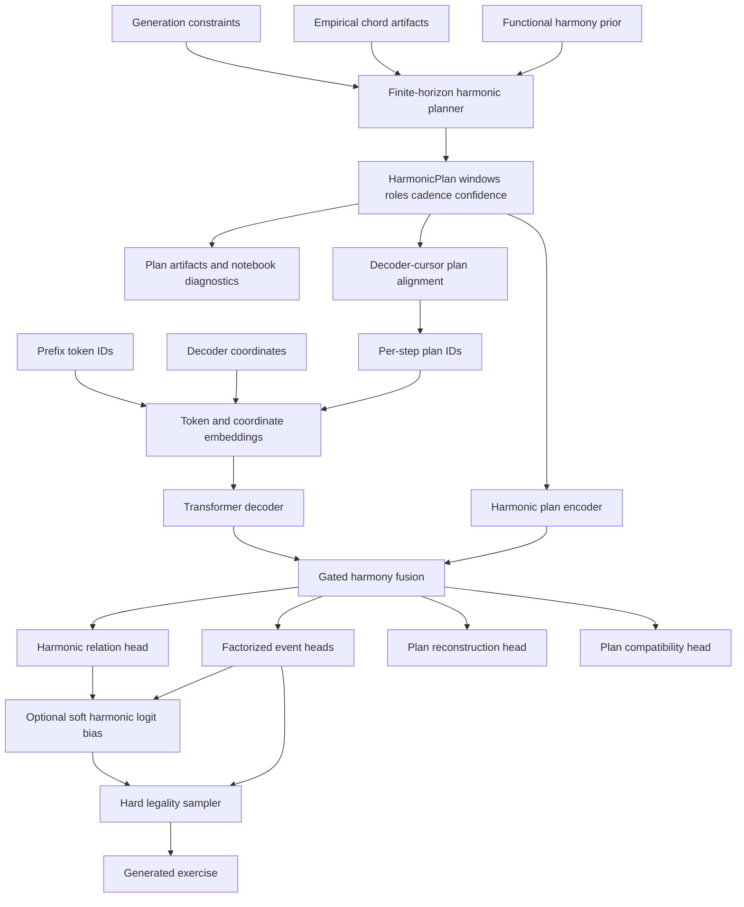

# Harmonic Planner And Learnable Harmony Conditioning

This document is the implementation plan for replacing blind harmonic sampling with directional harmonic planning and
for teaching the neural decoder to realize that plan without snapping every note to chord tones.

It refines the harmony-related parts of [coherence-plan.md](coherence-plan.md). The implementation
must keep hard legality constraints separate from musicality and must update [model.md](model.md) whenever model
inputs, training losses, generation behavior, or artifacts change.

## Problem

The current model can produce legal token sequences under hard constraints, but generation remains harmonically weak.
The sampled chord plan is not a plan in the compositional sense: it is a locally sampled chord track whose next state is
mostly determined by the previous state. That can produce plausible adjacent pairs while still wandering aimlessly over
the whole exercise.

The decoder also receives harmony as additive per-step embeddings only. This gives the model a hint, but it does not
teach what it means to realize a chord, when non-chord tones are idiomatic, or how strongly harmony should influence a
left-hand bass note versus a right-hand passing tone.

## Design Position

Use two separate layers of inductive bias:

1. A finite-horizon harmonic planner produces the entire harmonic path before note generation.
2. The decoder learns a soft relation between generated notes and the planned harmony.

The planner should be explicit, inspectable, and mostly non-neural at first. The neural side should learn how to use the
plan, not replace the plan before we can evaluate whether planning is useful.

## Related Work Distillation

Recent symbolic systems that improve structure usually expose a higher-level object above note tokens:

- description-to-sequence control codes;
- phrase-level and skeleton-note conditioning;
- chord or form-aware hierarchical representations;
- cross-attention from event decoders to high-level plans;
- gated conditioning modules that allow the model to decide when external structure matters;
- guidance or critic objectives separate from the raw event likelihood.

The useful lesson for this project is not to copy one paper's architecture wholesale. The useful lesson is that note
autoregression alone is the wrong place to learn global direction from limited data.

## Definitions

### Harmonic Slot

A harmonic slot is a score-time span during which the planner assumes one harmonic context is active.

Initial default:

```text
harmonic_resolution = 1 slot per bar
```

The first planned ablation is:

```text
harmonic_resolution = 2 slots per bar
```

Do not use denser resolutions until the decoded corpus plans and generated plans can be inspected reliably. Noisy chord
flips are worse than coarse but directional harmony.

### Finite Horizon

Finite-horizon planning means the planner knows the full length of the requested exercise before it chooses the first
chord.

For a generation request with `bar_count` bars and `harmonic_resolution` slots per bar:

```text
H = bar_count * harmonic_resolution
```

The planner chooses:

```text
C_1, C_2, ..., C_H
```

as one globally scored sequence. Scores may depend on:

- slot index;
- distance to the final slot;
- phrase role;
- terminal cadence targets;
- repeated material across non-adjacent slots;
- local chord priors;
- adjacent chord transitions.

This is different from a Markov sampler:

```text
p(C_i | C_{i-1})
```

because the final slot and cadence-preparation slots can affect earlier choices. Pair transitions remain useful, but
only as one term inside the sequence score.

Finite-horizon planning has three concrete implementation requirements:

1. The planner receives `bar_count` and `harmonic_resolution` before chord decoding starts.
2. The planner derives `slot_role` and `distance_to_end` from the full horizon before scoring candidate chords.
3. The planner emits windows that cover the complete requested score span exactly.

The third point is not cosmetic. If generation is still inside the requested bar span but harmonic alignment has already
fallen off the end of the plan, the model will receive unknown harmonic context at the exact point where it most needs
cadential direction. That must be treated as a planner/alignment bug, not as a valid fallback.

### Harmonic Entity

The core chord identity should stay factorized and key-relative:

```text
root_degree
root_accidental
quality
extension
```

`extension` should remain coarse:

```text
triad
seventh
major_seventh
```

Do not add ninths, altered chords, suspensions, inversions, or slash chords in the first implementation. They are
musically important, but the current chord decoder is not reliable enough to make those labels useful training targets.

The planned state should add functional and structural fields:

```text
harmonic_function
slot_role
distance_to_end
cadence_strength
tension_level
plan_confidence
```

`plan_confidence` is important because decoded training plans and generated plans are not equally trustworthy. It gives
losses and generation-time bias a way to back off.

## Planner Representation

The planner should emit an immutable, serializable plan:

```text
HarmonicPlan
  windows: tuple[HarmonicPlanWindow, ...]
  score: float
  alternatives: tuple[HarmonicPlanAlternative, ...]
```

Each window should contain:

```text
start
end
chord
harmonic_function
slot_role
distance_to_end
cadence_strength
tension_level
plan_confidence
score_terms
```

The existing `HarmonicPlanWindow` can be extended or wrapped. The important requirement is that notebook artifacts and
MLflow sample artifacts expose the fields directly. If the model hears a bad plan, we need to see that before blaming
the decoder.

## Slot Roles

Start with four roles:

```text
opening
continuation
cadence_preparation
cadence
```

Default assignment:

```text
H = 1:
  cadence

H = 2:
  cadence_preparation, cadence

H = 3:
  opening, cadence_preparation, cadence

H >= 4:
  slot 1: opening
  final slot: cadence
  previous 1 or 2 slots: cadence_preparation
  all remaining slots: continuation
```

For eight- and sixteen-bar examples, phrase substructure can later split the horizon into phrase-sized groups. The
first implementation should avoid pretending it has a full form model.

## Candidate Chords

The first candidate set should be deliberately small:

- diatonic triads in the active scale;
- optionally diatonic seventh and major-seventh variants when enabled by config;
- one accidental level around the diatonic root only after manual inspection justifies it.

Suggested initial limits:

```yaml
candidate_limit_per_slot: 16
max_root_accidental_abs: 0
enabled_extensions:
  - triad
```

For the first training-quality experiment, triads are enough. Sevenths can be enabled for generation inspection and a
later ablation:

```yaml
enabled_extensions:
  - triad
  - seventh
  - major_seventh
seventh_prior_penalty: 0.7
```

The penalty keeps sevenths available without making the planner hallucinate tension everywhere.

## Plan Score

The planner maximizes:

```text
S(C_1:H) =
  sum_i unary_score(C_i, i)
+ sum_i pair_score(C_{i-1}, C_i, i)
+ global_score(C_1:H)
```

All score terms should be logged separately.

### Unary Score

```text
unary_score(C_i, i) =
  w_prior * log p_prior(C_i)
+ w_role * role_compatibility(C_i, role_i)
+ w_cadence * cadence_compatibility(C_i, role_i, distance_to_end_i)
+ w_tension * tension_curve_score(C_i, i)
+ w_extension * extension_prior(C_i)
```

Suggested starting weights:

```yaml
w_prior: 0.50
w_role: 0.80
w_cadence: 1.50
w_tension: 0.25
w_extension: 0.30
```

### Pair Score

```text
pair_score(C_{i-1}, C_i, i) =
  w_empirical_transition * log p_empirical(C_i | C_{i-1})
+ w_functional_transition * log p_functional(C_i | C_{i-1})
+ w_root_motion * root_motion_score(C_{i-1}, C_i)
+ w_stasis * stasis_score(C_{i-1}, C_i, i)
+ w_cadence_approach * cadence_approach_score(C_{i-1}, C_i, role_i)
```

Suggested starting weights:

```yaml
w_empirical_transition: 0.60
w_functional_transition: 0.80
w_root_motion: 0.20
w_stasis: 0.25
w_cadence_approach: 1.00
```

If empirical transition artifacts are unavailable, replace `log p_empirical` with `0.0` and keep the functional prior.

### Global Score

```text
global_score(C_1:H) =
  w_terminal * terminal_cadence_score(C_1:H)
+ w_repetition * repetition_variation_score(C_1:H)
+ w_diversity * harmonic_diversity_score(C_1:H)
+ w_shape * tension_shape_score(C_1:H)
```

Suggested starting weights:

```yaml
w_terminal: 2.00
w_repetition: 0.25
w_diversity: 0.20
w_shape: 0.30
```

`terminal_cadence_score` should strongly prefer final tonic-area closure, but it should start as a soft score, not a
hard constraint. A generated sight-reading exercise usually should close, but making this hard too early can mask plan
quality issues and reduce variety.

### Cadence Defaults

Initial cadence scoring:

```text
final tonic-area chord: +2.0
final non-tonic chord: -1.0
dominant -> tonic into final slot: +1.25
predominant -> dominant in cadence preparation: +0.75
continuation -> tonic without cadence preparation: +0.10
```

Use function areas first. Avoid hardcoding specific progressions such as `ii V I` as the only valid answer.

## Decoding Algorithm

Use beam search rather than plain Viterbi at first, because repetition, diversity, and tension-shape terms are easier
to express with short history.

Suggested starting config:

```yaml
planner:
  harmonic_resolution: 1
  beam_size: 64
  candidate_limit_per_slot: 16
  alternatives_to_log: 8
  sample_from_top_k_plans: 4
  plan_temperature: 0.80
```

`sample_from_top_k_plans` keeps generation from becoming deterministic while still choosing from globally coherent
plans.

For test cases, use deterministic best-plan decoding. For generation, sample among top alternatives by seed.

## Training Alignment

Training should continue to align plan fields through the decoder cursor:

```text
absolute_position = bar_start(bar_index) + bar_relative_ticks / duration_tick_denominator
```

For each decoder step, align the active harmonic window and provide:

```text
harmonic_function_id
root_degree_id
root_accidental_id
quality_id
extension_id
chord_change_id
slot_role_id
distance_to_end_id
cadence_strength_id
tension_level_id
plan_confidence
```

Existing harmony fields can remain. New fields should be added behind config flags and logged in dataset examples and
generation artifacts.

Length awareness must be explicit. Hard generation constraints already know the requested `bar_count`, and the planner
knows the full horizon, but the neural decoder should not have to infer target length only from prefix tokens.

The decoder should receive these per-step or per-sample controls:

```text
current_bar_index
total_bar_count
remaining_bars
remaining_harmonic_slots
slot_role_id
distance_to_end_id
cadence_strength_id
```

`total_bar_count` may stay bucketed through structural conditioning, but `remaining_bars` and
`remaining_harmonic_slots` should be low-cardinality per-step IDs. They are different from legality constraints:
legality says when the model must stop; these controls tell the model that it is approaching a musical ending.

During generation, plan alignment must satisfy:

```text
requested_score_start <= aligned_position < requested_score_end
  => known harmonic slot
```

If this invariant fails, generation should fail loudly in strict mode. Silent unknown fallback is acceptable only for
padding positions and explicitly disabled harmony conditioning.

## Model Conditioning

### Baseline Path

Keep the current additive embeddings as a baseline:

```text
token_embedding_t += harmonic_field_embeddings_t
```

This is cheap and useful for ablations, but it is not expressive enough as the final design.

### Planned Path

Add a small harmonic-plan encoder and gated decoder fusion:

```text
plan_slot_embeddings = embed(plan fields per slot)
plan_memory = HarmonicPlanEncoder(plan_slot_embeddings)
plan_context_t = cross_attention(decoder_state_t, plan_memory, active_slot_mask_t)
gate_t = sigmoid(W_gate [decoder_state_t, active_plan_embedding_t, coordinates_t])
decoder_state_t = decoder_state_t + harmony_adherence_alpha * gate_t * plan_context_t
```

Suggested starting config:

```yaml
harmony_conditioning:
  fusion: gated_residual
  plan_encoder_layers: 2
  plan_encoder_heads: 4
  plan_encoder_dropout: 0.10
  gate_init_bias: -1.50
  harmony_adherence_alpha: 1.00
  plan_field_dropout: 0.15
```

`gate_init_bias: -1.50` starts the gate near `0.18`, so the new path does not dominate the pretrained decoder at the
start of training.

The first implemented version uses `gated_residual`: the already aligned per-step plan embeddings are encoded by a
small Transformer encoder and added to token embeddings through a learned gate. Full slot-memory cross-attention is
still a later option if per-step residual fusion proves too weak.

Expose `harmony_adherence_alpha` in generation config later:

```yaml
harmony_adherence_alpha: 0.0   # ignore plan
harmony_adherence_alpha: 1.0   # trained default
harmony_adherence_alpha: 1.5   # stronger harmonic pull
```

Do not expose it as a hard legality constraint.

### Planner End Versus Model Continuation

The planner and hard sampler have different responsibilities:

- the planner supplies musical direction through the requested horizon;
- hard generation constraints enforce the exact bar count and decide when `EndToken` is legal;
- the neural decoder proposes tokens under both of those signals.

If the model proposes more notes after the requested bars are complete, the hard sampler should mask those tokens out.
At that point only legal completion tokens should remain. This protects legality but not musicality.

The more important musical failure happens before the hard end: the model may be inside the final planned slot and still
write busy, directionless material. That is legal but incoherent. The final-slot conditioning and harmonic-relation
losses must therefore teach cadence behavior inside the last slot:

```text
slot_role = cadence
distance_to_end = 0
remaining_harmonic_slots = 0
cadence_strength = high
```

Expected behavior is not necessarily a whole note or a frozen texture. It is stable bass support, reduced harmonic
ambiguity on strong beats, and idiomatic final melodic motion.

## Loss Functions

The event objective remains the primary objective:

```text
L_event = factorized next-token cross entropy
```

The harmony objectives are auxiliary. They should be added one at a time and logged separately.

### Harmonic Relation Loss

For each target note token, derive a relation between the note and the active planned chord:

```text
chord_root
chord_third
chord_fifth
chord_seventh
diatonic_non_chord
chromatic_neighbor
passing_or_approach
suspension_or_anticipation
other_chromatic
```

Ignore non-note targets for this loss unless a future representation has explicit held-note relation labels.

The model predicts:

```text
p(relation_t | decoder_state_t, plan_t, coordinates_t)
```

Weighted loss:

```text
L_relation =
  sum_t w_t * CE(relation_logits_t, relation_target_t)
  / max(epsilon, sum_t w_t)
```

Suggested weight components:

```yaml
beat_weight:
  downbeat: 1.50
  strong_beat: 1.20
  weak_beat: 0.70
hand_weight:
  left: 1.20
  right: 1.00
slot_role_weight:
  opening: 1.00
  continuation: 1.00
  cadence_preparation: 1.20
  cadence: 1.50
plan_confidence_weight: true
```

Suggested loss weight:

```yaml
lambda_relation_pretrain: 0.03
lambda_relation_finetune: 0.05
```

This loss should encourage chord awareness on structurally important notes while leaving weak-beat melodic motion free.

### Plan Reconstruction Loss

Pool decoder states inside each harmonic slot and predict the plan fields back from the realized music:

```text
slot_state_i = pool({decoder_state_t | t aligned to slot i})
```

Predict:

```text
harmonic_function
root_degree
quality
extension
cadence_strength
```

Loss:

```text
L_plan_reconstruct =
  sum_fields lambda_field * CE(field_logits_i, field_target_i)
```

Starting field weights:

```yaml
function: 1.00
root_degree: 1.00
quality: 0.50
extension: 0.25
cadence_strength: 0.50
```

Suggested total loss weight:

```yaml
lambda_plan_reconstruct: 0.02
```

Important caveat: if the head can read the plan embedding directly, reconstruction can become a shortcut. Train this
head with plan-field dropout and corrupted-plan batches, or attach it to a representation where direct plan features
are not trivially recoverable.

### Contrastive Plan Compatibility Loss

For each sample, create corrupted plans:

- shift roots;
- shuffle slots;
- remove cadence role;
- replace functions while keeping rhythm;
- swap with another sample of the same scale type.

Encode the realized music and candidate plans:

```text
z = music_summary(sample)
p_pos = plan_summary(correct_plan)
p_neg_k = plan_summary(corrupted_plan_k)
```

Use InfoNCE:

```text
L_contrast =
  -log exp(score(z, p_pos) / tau)
       / (exp(score(z, p_pos) / tau) + sum_k exp(score(z, p_neg_k) / tau))
```

Suggested starting config:

```yaml
contrastive_negative_count: 3
contrastive_temperature: 0.20
lambda_contrast: 0.00
```

Start disabled. Enable at `0.01` only after relation loss metrics are stable and manual samples suggest the model still
ignores the plan.

### Optional Gate Regularization

Do not add gate regularization at first. Log gate statistics before forcing a target.

If the gate collapses to always-on or always-off, add:

```text
L_gate_mean = (mean(gate_t) - target_gate_mean)^2
```

Suggested fallback:

```yaml
target_gate_mean: 0.30
lambda_gate_mean: 0.005
```

### Total Loss

Initial total:

```text
L_total =
  L_event
+ lambda_musical_aux * L_musical_aux
+ lambda_relation * L_relation
+ lambda_plan_reconstruct * L_plan_reconstruct
```

Later, if justified:

```text
L_total += lambda_contrast * L_contrast
L_total += lambda_gate_mean * L_gate_mean
```

## Generation-Time Harmonic Bias

Do not hard-filter notes to chord tones.

After the relation head is trained, add an optional soft logit bias:

```text
logit'(token_t) =
  logit(token_t)
+ alpha_bias * compatibility_score(token_t, plan_t, coordinates_t, hand_t)
```

Suggested starting config:

```yaml
harmonic_logit_bias_enabled: false
harmonic_logit_bias_alpha: 0.20
```

Enable only after generation metrics show the model hears the plan but does not follow it enough. The bias must allow
passing and neighbor tones, especially on weak beats.

## Metrics

### Planner Metrics

Log for generated plans and decoded corpus plans:

- final tonic-area rate;
- cadence-preparation dominant or predominant rate;
- dominant-to-tonic final approach rate;
- final-slot known-alignment rate;
- requested-span plan coverage rate;
- mean role compatibility score;
- mean transition score;
- mean terminal cadence score;
- harmonic self-transition rate;
- longest same-chord run;
- unique chord count per sample;
- extension usage rate;
- plan entropy across sampled alternatives;
- top plan score margin over alternative plans.

These metrics evaluate the planner before evaluating the decoder.

### Plan Adherence Metrics

Log for generated music:

- decoded-vs-planned harmonic-function agreement;
- decoded-vs-planned root-degree agreement;
- decoded-vs-planned quality agreement;
- strong-beat chord-tone coverage by hand;
- weak-beat chord-tone coverage by hand;
- strong-beat non-chord chromatic rate;
- weak-beat diatonic non-chord rate;
- cadence-slot bass support;
- final-slot closure;
- relation-head accuracy and macro F1;
- relation distribution total variation distance to corpus;
- gate mean by hand, beat strength, and slot role;
- plan-corruption sensitivity;
- final-slot token count by hand;
- final-slot strong-beat chord-tone coverage;
- final-slot bass support rate;

`plan-corruption sensitivity` means evaluating whether the same prefix with a corrupted plan changes note
probabilities in the expected direction. If corrupting the plan barely changes logits, the model is ignoring harmony.

### Anti-Overconstraint Metrics

Track these to catch bland chord-tone generation:

- all-note chord-tone coverage;
- weak-beat chord-tone coverage;
- repeated pitch rate;
- melodic step/leap distribution;
- passing-or-approach relation rate;
- non-chord tones that resolve by step;
- figure and rhythm distribution distance to the corpus.

Suggested warning ranges for generated samples, not hard targets:

```yaml
strong_beat_chord_tone_coverage:
  low_warning: 0.55
  high_warning: 0.90
weak_beat_chord_tone_coverage:
  low_warning: 0.25
  high_warning: 0.75
final_slot_closure:
  low_warning: 0.60
```

The goal is not maximum chord-tone coverage. The goal is strong-beat clarity with weak-beat freedom.

## Implementation Phases

### Phase 1: Finite-Horizon Planner

- Add harmonic slot role and distance-to-end fields.
- Implement candidate generation.
- Implement beam search with logged score terms.
- Keep empirical transitions optional.
- Return full plan alternatives in artifacts.
- Validate that plan windows cover the full requested score span exactly.
- Add strict alignment failure for in-span positions that receive unknown harmony.

Acceptance:

- Two-bar plans prefer cadence-directed shapes over arbitrary local pairs.
- Four- and eight-bar plans expose roles and terminal scores.
- Unit tests cover short horizons, cadence preference, stasis penalty, deterministic seeded sampling, full-span
  coverage, and no unknown harmony inside the requested span.

### Phase 2: Planner Inspection

Status: implemented for generation artifacts and reusable notebook utilities.

- Add plan summaries to generation artifacts.
- Add notebook display for role-labeled plans.
- Add piano-roll chord cue overlay if reusable code exists; otherwise defer and document the gap.

Acceptance:

- A human can inspect whether the planner failed before listening to the model.

Implementation notes:

- `samples.jsonl` includes selected plan windows, role/end metadata, score terms, compact summaries, and top
  alternatives when generation uses the finite-horizon planner.
- `notebooks.utils.harmony.harmonic_plan_inspection` accepts explicit plan windows and can render role-labeled chord
  cues through the existing piano-roll highlight path.

### Phase 3: Extended Plan Conditioning Fields

Status: implemented for additive harmonic-plan conditioning.

- Add `slot_role`, `distance_to_end`, `cadence_strength`, `tension_level`, and `plan_confidence` IDs.
- Add per-step `remaining_bars` and `remaining_harmonic_slots` IDs.
- Align them with the existing decoder cursor path.
- Keep additive embeddings as the initial ablation.

Acceptance:

- Training and generation run with the extended fields.
- Metrics show non-unknown field coverage.
- Generation evaluation logs final-slot behavior separately from all-slot averages.

Implementation notes:

- `HarmonicPlanInputTensors` now contains the original chord/function fields plus slot role, distance-to-end,
  cadence-strength, tension-level, plan-confidence, remaining-bar, and remaining-harmonic-slot IDs.
- Harmonic-plan field registration drives model embedding construction, tensor padding, and gradient coverage tests, so
  additive conditioning automatically includes the extended fields.
- Decoded corpus chord windows are annotated with finite-horizon slot fields before teacher-forcing alignment. Generated
  plans already carry these fields from the finite-horizon planner.
- `remaining_bars` is computed from the decoder cursor and requested bar count during alignment. `remaining_harmonic_slots`
  comes from the active plan window's `distance_to_end`.
- Generation harmony metrics include plan-field known rates and final-slot chord-tone coverage alongside the all-slot
  harmony metrics.

### Phase 4: Harmonic Relation Targets And Loss

Status: implemented for teacher-forced training.

- Derive relation labels from target notes and active plan windows.
- Add relation head and weighted CE loss.
- Log relation accuracy, macro F1, and relation distribution.

Acceptance:

- Relation loss learns above chance.
- Generated strong-beat and weak-beat relation distributions move in the intended direction without becoming all
  chord tones.

Implementation notes:

- `HarmonicRelationTargetTensors` are derived during dataset construction whenever training harmony conditioning is
  enabled. Labels are ignored for non-note targets and positions without an aligned harmonic window.
- Relation classes are intentionally coarse: root, third, fifth, seventh, diatonic non-chord, chromatic neighbor, and
  other chromatic. Passing/suspension/anticipation labels remain deferred because they require local resolution context
  rather than a single-note chord relation.
- `harmonic_relation_objective` weights the CE loss by beat strength, active hand, slot role, and optional
  plan-confidence buckets. Default pretraining/finetuning weights keep the objective auxiliary: `0.03` for pretraining
  and `0.05` for finetuning.
- Training logs relation loss, accuracy, macro F1, target distribution, and prediction distribution for both train and
  validation splits.

### Phase 5: Gated Plan Encoder

Status: implemented as gated residual fusion.

- Add harmonic-plan encoder.
- Add gated cross-attention or gated residual fusion.
- Log gate statistics.
- Compare against additive embeddings.

Acceptance:

- Gate is neither always zero nor always one.
- Generation metrics improve plan adherence or closure without degrading rhythm and melodic diagnostics.

Implementation notes:

- `conditioning.harmony.fusion` supports `additive` and `gated_residual`.
- `gated_residual` embeds the aligned plan fields, applies plan-field dropout, encodes the per-step sequence with a
  small Transformer encoder, and adds `harmony_adherence_alpha * sigmoid(gate) * plan_context` to token embeddings.
- The relation head is attached to the decoded states when harmony conditioning is enabled.
- Training logs `harmony_gate_mean`; gate regularization remains deferred until the metric shows collapse.

### Phase 6: Reconstruction And Contrastive Objectives

Status: reconstruction implemented and enabled at low weight; contrastive compatibility implemented but disabled by
default.

- Add plan reconstruction after relation loss is stable.
- Add contrastive compatibility only if needed.
- Use corrupted-plan batches for both.

Acceptance:

- Corrupted plans produce measurable compatibility differences.
- Manual samples show stronger harmonic intent.

Implementation notes:

- The model now exposes per-step reconstruction heads for harmonic function, root degree, quality, extension, and
  cadence strength when harmony conditioning is enabled.
- Reconstruction groups teacher-forced decoder states by aligned `remaining_harmonic_slot_ids` plus plan-field IDs,
  pools token states inside each group, and applies weighted cross-entropy per field. This avoids treating repeated
  events in one slot as independent reconstruction targets.
- The default training configs enable reconstruction at `weight: 0.02` with field weights matching this plan.
- The contrastive objective projects pooled realized-music states and pooled plan embeddings, then uses InfoNCE-style
  in-batch negatives. It is wired and logged, but defaults to `enabled: false` and `weight: 0.0`.
- Explicit corrupted-plan batches remain deferred. In-batch negatives are the first lower-risk compatibility signal;
  corruption taxonomy should be added only if contrastive evaluation shows value.

### Phase 7: Optional Soft Harmonic Logit Bias

Status: implemented behind generation-evaluation config and disabled by default.

- Use the learned relation or compatibility head for soft token bias.
- Keep disabled by default until evaluated.

Acceptance:

- Bias improves adherence without triggering anti-overconstraint warnings.

Implementation notes:

- Generation config now exposes `harmonic_logit_bias_enabled` and `harmonic_logit_bias_alpha`.
- When enabled, generation calls `training_logits`, reads the current relation-head probabilities, classifies every
  candidate note token against the active planned chord, and adds a centered relation-probability bias to token logits.
- The bias is applied before hard legality masking and top-k sampling. Non-note tokens are not biased.
- The default alpha is `0.20`, but the flag remains off so ordinary evaluation runs stay comparable.

## Experiment Ladder

Run each step against the previous best model:

1. Planner-only inspection, no model change.
2. Add extended plan fields with additive embeddings.
3. Add relation loss.
4. Add gated plan encoder.
5. Add plan reconstruction.
6. Add contrastive compatibility if needed.
7. Add soft generation bias if needed.

For each step, compare:

- validation event loss;
- generation legality;
- planner metrics;
- plan adherence metrics;
- coherence diagnostics;
- manual notebook inspection.

Do not accept a change only because teacher-forced validation loss improves.

## Risks

### Bad Plan Quality

If the planner is noisy, the model will learn noisy harmony. Keep planner artifacts inspectable and use
`plan_confidence` to reduce loss weight for uncertain windows.

### Literal Chord-Tone Output

Relation loss and soft bias can overfit to chord tones. Keep weak-beat and passing-tone metrics visible. Do not optimize
raw chord-tone coverage directly.

### Formulaic Cadences

A strong terminal score may make every sample close the same way. Sample from top plans and use repetition/variation
terms. Keep cadence closure soft until manual inspection says otherwise.

### Minor-Scale Noise

Minor decoding is known to be weaker. Start evaluation on major examples, then inspect minor separately. Do not use
minor failures as the first reason to discard the planner.

### Shortcut Learning

Plan reconstruction can become trivial if the head reads the plan embedding. Use plan dropout, corrupted plans, or
representation boundaries so the head measures realization rather than memory.

## Planned Architecture


