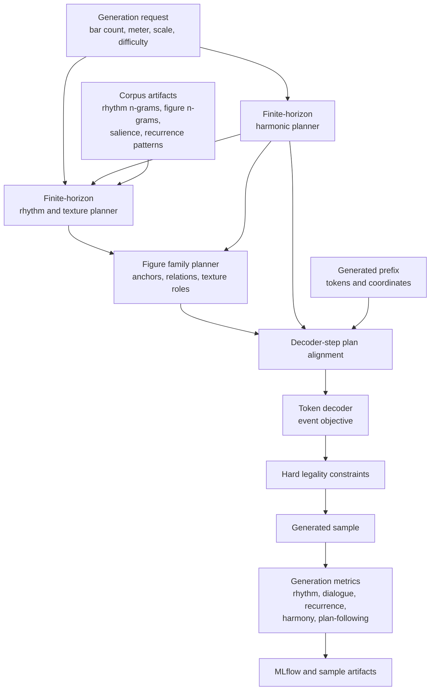
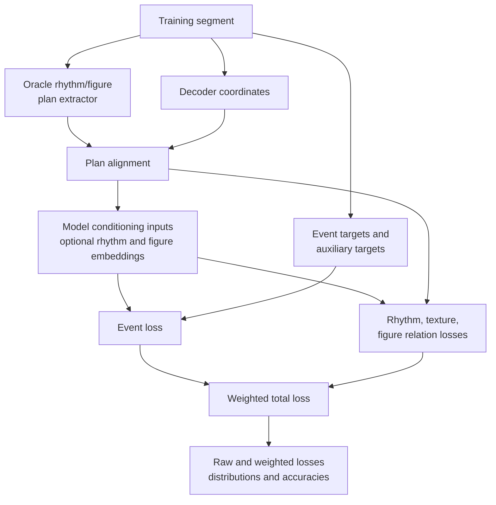

# Rhythm And Figure Planning

This document is the implementation plan for adding rhythmic, textural, and figure-level structure above the token
decoder. It refines Phase 5 through Phase 7 of [coherence-plan.md](coherence-plan.md) and should be read together with
[harmonic-planer.md](harmonic-planer.md).

The immediate goal is not to commit to a large new architecture. The immediate goal is to make rhythm and figure
coherence measurable, inspectable, and usable as a planning signal before we ask the neural decoder to learn from it.

## Problem

Recent training runs show that the model can produce legal token streams, but legal output is still often static,
aimless, and weakly coordinated between hands. Harmony conditioning helps with local chord context, but it does not
create phrasing, rhythmic memory, call-and-response, or repeated figures with variation.

The current decoder still has to infer too much from the autoregressive prefix:

- where the exercise is in its phrase;
- whether a hand should enter, answer, sustain, or rest;
- whether a bar should repeat, vary, contrast, or close;
- how a rhythmic figure should return later;
- when a long note is structural and when it is degenerate stasis;
- how both hands should coordinate without collapsing into block chords.

This is too much structure to expect from limited target data and a next-token objective alone.

## Design Position

Add a rhythm and figure planning layer between global harmony and note-level decoding:

```text
bar count, meter, difficulty, harmony plan
  -> rhythm/texture plan
  -> figure plan
  -> note decoder
```

The first implementation should be diagnostic and mostly non-neural. It should answer:

1. Can we measure the current failure modes?
2. Can we extract stable rhythm and figure abstractions from the corpus?
3. Can we draw these abstractions over real and generated samples?
4. Can a simple finite-horizon planner produce better rhythmic intent than raw decoding?
5. Does conditioning the model on these plans improve generation?

If the answer to any early question is no, stop and fix that layer before adding more model capacity.

## Lessons From The Current Runs

- Whole-bar and whole-note events must be measured directly. Some long notes are musically valid, but the recent model
  uses them as a fallback too often.
- Harmony alone is insufficient. A plan can say "dominant", while the hands still wander locally or ignore each other.
- Pairwise chord transitions are not enough for harmonic direction. The same warning applies to rhythmic n-grams:
  adjacent plausibility does not guarantee phrase structure.
- Training losses need observability. Every new auxiliary loss must log raw loss, weighted contribution, accuracy or
  distribution metrics, and generation-side effect.
- Reranking and planning are useful only if their term breakdowns remain inspectable.

## Design Principles

1. Use n-grams as empirical scoring priors, not as direct length samplers.
2. Do not sample an n-gram length from corpus frequencies. Longer n-grams contain shorter k-grams, so naive length
   sampling overcounts subpatterns.
3. Separate legality from musicality. Hard generation constraints remain responsible for valid bars and token grammar.
4. Learn metrical salience from corpus statistics. Downbeats are features, not automatic accents.
5. Prefer finite-horizon planning over local autoregression. The planner must know the requested bar count before it
   chooses the first rhythmic state.
6. Make every abstraction drawable before it becomes a model input.
7. Start with rhythm and texture. Add figure embeddings only after rhythm plans and figure labels are stable enough to
   inspect.
8. Keep all semantic values in config or shared constants. Do not hardcode musical thresholds in implementation modules.

## Core Definitions

Implementation should use frozen Pydantic models for serialized entities and small `StrEnum` classes for categorical
labels. Runtime counters and temporary scoring structures can use dataclasses when they are not persisted.

### Planning Grid

The planning grid is the rhythmic lattice used by the rhythm planner. It is coarser than token time and should start
with eighth-note cells:

```yaml
planning_grid_denominator: 8
```

This denominator is relative to the whole note. For 4/4, denominator 8 gives eighth-note cells. Sixteenth-note planning
can be an ablation:

```yaml
planning_grid_denominator: 16
```

The grid must be derived from the active `DurationVocabulary` and bar durations. Pickup and short-final bars must use
the same cursor and bar-duration logic as generation coordinates.

### Rhythm Grid Cell

A `RhythmGridCell` identifies one hand-independent time cell:

```text
bar_index
cell_index
start
end
bar_relative_start
bar_relative_end
metrical_offset
learned_salience_id
distance_to_end
```

`start` and `end` should use exact `Fraction` values or integer ticks. Floating-point values are allowed only in
notebook data frames.

### Hand Activity

Per hand, each grid cell has one activity label:

```text
rest
onset
sustain
release
```

`release` is optional in the first metrics pass. The minimum useful activity alphabet is:

```text
rest
onset
sustain
```

This distinguishes "no music", "new event", and "held sound". That distinction is essential for separating a valid
long note from degenerate whole-bar stasis.

### Coactivity Mode

For both hands together, each grid cell has a coactivity label:

```text
silent
right_only
left_only
both_synchronized
right_answers_left
left_answers_right
interleaved
both_sustain
```

The answer labels should be derived from a configurable lag window, initially:

```yaml
answer_lag_cells:
  min: 1
  max: 4
```

For an eighth-note planning grid, this covers an eighth-note through half-note response window.

### Rhythm Texture Slot

A `RhythmTextureSlot` describes a short time span, usually one bar or half bar:

```text
start
end
role
right_activity_template_id
left_activity_template_id
coactivity_template_id
right_density_bucket
left_density_bucket
syncopation_bucket
long_sustain_bucket
texture_role
```

Initial texture roles:

```text
melody
bass_support
accompaniment
echo
interleaved_dialogue
sparse_rest
cadence_support
```

The role is descriptive at first. It should not become a hard generation rule until corpus and generated examples show
that it is stable.

### Onset Template

An onset template is the set of grid offsets where a hand starts new events inside a slot:

```text
slot_length_cells
onset_cells
```

For comparison, use both exact identity and similarity. Exact identity is useful for recurrence; similarity is needed
for variation.

### Duration Profile

A duration profile is a compact summary of event durations inside a slot:

```text
short_count
medium_count
long_count
whole_bar_or_longer_count
dotted_count
held_through_strong_cell_count
```

Duration bucket boundaries must live in config, not in the metric implementation.

### Accent Template

An accent template is not a hard downbeat map. It is a learned salience vector over grid cells:

```text
salience[cell] in [0, 1]
```

The first version should estimate salience from corpus statistics:

- onset probability at the cell;
- duration-weighted onset mass;
- co-onset or chord mass;
- phrase-boundary proxy mass;
- sustain-through-next-salient-cell mass.

Downbeat, beat, and offbeat offsets are input features to this estimate. They are not the estimate itself.

### Figure Plan Slot

A `FigurePlanSlot` describes one planned gesture realization:

```text
start
end
hand
texture_role
rhythm_template_id
contour_family_id
interval_family_id
chord_relation_family_id
anchor_degree
anchor_accidental
register_bucket
relation_to_previous
relation_reference_id
plan_confidence
```

The figure slot deliberately avoids exact pitch identity. The target abstraction is "a rising stepwise eighth-note
answer from scale degree 5", not "G4 A4 B4".

### Figure Relation Label

Initial labels:

```text
new
repeat
varied_repeat
answer
contrast
cadence_fill
```

These labels should be assigned by deterministic extraction first. If assignment is too noisy, keep them as metrics
and do not train on them yet.

### Rhythm Figure Plan

The persisted plan should cover the requested span exactly:

```text
RhythmFigurePlan
  grid
  texture_slots
  figure_slots
  learned_salience
  score_terms
  alternatives
```

The same coverage rule used by the harmonic planner applies here. If the decoder reaches a valid in-span score
position and no rhythm/figure plan entry covers it, that is a planner or alignment bug.

## N-Gram Use

Existing figure and rhythm n-gram artifacts are valuable, but they should not become a naive sampler.

### Interpolated Conditional Scoring

For a planned state sequence:

```text
z_1, z_2, ..., z_T
```

score each state with an interpolated n-gram model:

```text
P(z_t | history) =
  lambda_4 * P_4(z_t | z_{t-3:t-1})
+ lambda_3 * P_3(z_t | z_{t-2:t-1})
+ lambda_2 * P_2(z_t | z_{t-1})
+ lambda_1 * P_1(z_t)
+ lambda_0 * P_0(z_t)
```

The sequence score is:

```text
S_ngram = mean_t log(max(epsilon, P(z_t | history)))
```

Use validation-fitted interpolation weights when enough data is available. Suggested starting values:

```yaml
ngram_order: 4
epsilon: 1.0e-8
interpolation_weights:
  order_4: 0.25
  order_3: 0.25
  order_2: 0.25
  order_1: 0.15
  backoff: 0.10
```

If validation NLL shows that high-order counts are sparse or noisy, shift weight toward lower orders rather than
dropping the scorer entirely.

### Closed And Maximal Phrase Patterns

For recurrence and motif planning, mine phrase patterns separately from the token n-gram scorer.

A recurring phrase pattern is a sequence of onset templates, coactivity modes, and duration profiles over a fixed span.
Candidate spans should start small:

```yaml
candidate_phrase_lengths_bars:
  - 1
  - 2
```

Do not count every subpattern equally. A shorter pattern should not gain artificial importance only because it appears
inside many longer patterns.

Use two filters:

- Closed pattern filter: if a pattern and a superpattern have the same support, keep the superpattern for motif
  planning and keep the shorter pattern only for backoff scoring.
- Maximal non-overlap support: count occurrences with a non-overlap rule when estimating how often a motif genuinely
  returns within one exercise.

This keeps short fragments useful while preventing them from dominating the planner.

## Self-Similarity Metrics

Self-similarity must measure structured recurrence, not just repeated tokens.

### Phrase Similarity

For two same-length rhythm phrases `A` and `B`:

```text
sim(A, B) =
  w_onset * onset_similarity(A, B)
+ w_ioi * ioi_similarity(A, B)
+ w_duration * duration_profile_similarity(A, B)
+ w_accent * accent_similarity(A, B)
+ w_activity * coactivity_similarity(A, B)
```

Suggested starting weights:

```yaml
self_similarity_weights:
  onset: 0.35
  ioi: 0.20
  duration: 0.20
  accent: 0.15
  coactivity: 0.10
```

Component definitions:

- `onset_similarity`: Jaccard similarity over onset cells.
- `ioi_similarity`: one minus normalized edit distance over inter-onset interval classes.
- `duration_profile_similarity`: one minus total variation distance over duration buckets.
- `accent_similarity`: cosine similarity over salience-weighted onset vectors.
- `coactivity_similarity`: fraction of matching coactivity labels, optionally allowing answer-label swaps.

### Relation Thresholds

Initial thresholds should be configurable:

```yaml
figure_relation_thresholds:
  repeat_min_similarity: 0.95
  varied_repeat_min_similarity: 0.65
  answer_min_similarity: 0.55
  contrast_max_similarity: 0.35
```

Suggested interpretation:

- `repeat`: same hand or cross-hand pattern with near-identical rhythm.
- `varied_repeat`: same role or reference family with recognizable rhythmic change.
- `answer`: opposite-hand phrase within the configured lag window and above answer similarity.
- `contrast`: low similarity but compatible density and phrase role.
- `cadence_fill`: short closing gesture in a cadence slot.

### Reported Metrics

Reference-free metrics:

- `rhythm/self_similarity/mean/bar_pair_similarity`
- `rhythm/self_similarity/mean/phrase_pair_similarity`
- `rhythm/self_similarity/rate/exact_repeat`
- `rhythm/self_similarity/rate/varied_repeat`
- `rhythm/self_similarity/rate/answer`
- `rhythm/self_similarity/rate/contrast`
- `rhythm/self_similarity/mean/best_lag_1_similarity`
- `rhythm/self_similarity/mean/best_lag_2_similarity`

Corpus-relative metrics:

- total variation distance for relation-label distributions;
- recurrence rate difference;
- answer rate difference;
- similarity-matrix summary distance.

The similarity matrix should be included in sample artifacts for inspection, not only reduced to scalar metrics.

## Accent And Syncopation Metrics

The model should not be rewarded for putting everything on downbeats. Sight-reading can include syncopation, and
downbeats do not always carry the perceived accent.

### Learned Salience Field

Estimate salience per time-signature and optional difficulty slice:

```text
salience(cell) =
  normalize(
    a_onset * onset_rate(cell)
  + a_duration * duration_weighted_onset_rate(cell)
  + a_chord * co_onset_mass(cell)
  + a_boundary * boundary_proxy_mass(cell)
  )
```

Suggested starting weights:

```yaml
salience_weights:
  onset: 1.0
  duration: 0.6
  chord: 0.4
  boundary: 0.4
```

These are corpus-estimation weights, not generation rewards.

### Syncopation Salience

A simple first metric:

```text
syncopation_salience =
  sum_onsets max(0, next_stronger_salience - onset_salience) * sustain_to_next_stronger
  / max(1, onset_count)
```

This captures the common case where an onset happens before a stronger metrical position and sustains or rests through
that stronger position. It should be logged descriptively. It should not be used as a penalty until corpus slices are
understood.

## Rhythm Planning Procedure

The planner receives:

```text
bar_count
time_signature
duration_vocabulary
scale_type
difficulty controls
harmonic_plan
optional reference profile artifacts
```

It emits a `RhythmFigurePlan` in four steps.

### Step 1: Build The Horizon

- Build exact grid cells for the requested bars.
- Assign phrase role and distance-to-end.
- Align harmonic windows to grid cells.
- Attach learned salience IDs.

### Step 2: Plan Rhythm And Texture

Use beam search over rhythm texture slots.

Suggested starting config:

```yaml
beam_size: 48
slot_resolution_bars: 1
max_alternatives: 8
density_bucket_count: 6
syncopation_bucket_count: 5
long_sustain_bucket_count: 4
```

Each beam state tracks:

- previous activity templates;
- previous coactivity modes;
- recent phrase-pattern references;
- open sustains by hand;
- density budget;
- relation labels already used;
- harmonic role and distance-to-end.

Score terms:

```text
S_texture =
  w_ngram * S_ngram
+ w_density * S_density
+ w_salience * S_salience
+ w_coupling * S_hand_coupling
+ w_recurrence * S_recurrence
+ w_variation * S_variation
+ w_cadence * S_cadence_texture
- w_stasis * P_stasis
- w_overcrowding * P_overcrowding
```

Suggested starting weights:

```yaml
texture_score_weights:
  ngram: 1.0
  density: 0.6
  salience: 0.4
  hand_coupling: 0.5
  recurrence: 0.4
  variation: 0.3
  cadence_texture: 0.5
  stasis_penalty: 1.2
  overcrowding_penalty: 0.8
```

The stasis penalty should target plan-level patterns like a whole-bar sustain with no answering activity. It should not
forbid long notes globally.

### Step 3: Assign Figure Families

For each active span, assign a figure family conditioned on:

- hand;
- texture role;
- rhythm template;
- phrase role;
- harmonic function;
- chord-relation profile;
- anchor degree;
- register bucket.

Start with labels extracted from current figure n-gram artifacts. Do not require learned figure embeddings in the first
planner.

### Step 4: Validate Coverage

Validate:

- all grid cells are covered;
- every figure slot sits inside a texture slot;
- no figure slot crosses a bar unless the duration profile allows a sustain;
- no in-span decoder coordinate maps to unknown rhythm context;
- cadence slots have some closing activity unless the requested style explicitly allows silence.

## Filling Procedure

The filling path should become stricter only after metrics and drawings prove that the plans are useful.

### Phase A: Diagnostics Only

Extract rhythm and figure plans from existing dataset and generated samples. Do not change generation.

This phase answers whether the abstractions distinguish corpus examples from bad model outputs.

### Phase B: Rhythm-Fixed Filling

Generate under a sampled or extracted rhythm plan. The decoder chooses pitches and local token details, but hard
constraints restrict activity to the planned onsets, hands, and broad duration profile.

This is the fastest way to test whether rhythm planning can improve perceived coherence without retraining the model.

Abort condition: if rhythm-fixed filling produces legal but mechanical output, move to Phase C instead of increasing
hardness.

### Phase C: Rhythm-Biased Filling

Use the plan as a logit bias rather than a hard mask:

```text
adjusted_logits =
  logits
+ alpha_activity * activity_bias
+ alpha_duration * duration_profile_bias
+ alpha_hand * hand_activity_bias
```

Suggested starting values:

```yaml
rhythm_bias:
  alpha_activity: 1.2
  alpha_duration: 0.7
  alpha_hand: 0.8
```

The bias must log plan-following rates. If the model ignores the plan, increase observability before increasing
weights.

### Phase D: Neural Plan Conditioning

Add rhythm and figure plan embeddings to decoder inputs:

```text
input_embedding =
  token_embedding
+ coordinate_embedding
+ harmonic_plan_embedding
+ rhythm_texture_embedding
+ active_figure_embedding
```

The first neural version should mirror the harmonic path:

- optional config flag;
- unknown ID at 0 for every field;
- additive baseline;
- gated residual ablation;
- per-field vocabulary sizes derived from config;
- no encoded artifact shape change unless necessary.

## Training Counterpart

Training should use extracted oracle plans before generated plans. This isolates model conditioning from planner
quality.

### Extracted Targets

From each training `Segment`, derive:

- grid activity labels per hand;
- coactivity labels;
- texture slots;
- figure slots;
- relation labels;
- learned-salience IDs;
- plan-following targets aligned to decoder coordinates.

As with harmony, derive tensors during dataset construction first. Persist in encoded artifacts only if extraction
becomes expensive or needed by multiple stages.

### Losses

Start with low-weight supervised objectives:

```text
L_total =
  L_event
+ w_musical_aux * L_musical_aux
+ w_harmonic_relation * L_harmonic_relation
+ w_rhythm_activity * L_rhythm_activity
+ w_texture * L_texture
+ w_figure_family * L_figure_family
+ w_figure_relation * L_figure_relation
+ w_contrastive_figure * L_contrastive_figure
```

Suggested starting weights:

```yaml
loss_weights:
  event: 1.0
  musical_auxiliary: 0.05
  harmonic_relation: 0.05
  harmonic_reconstruction: 0.0
  harmonic_contrastive: 0.0
  rhythm_activity: 0.10
  texture: 0.06
  figure_family: 0.04
  figure_relation: 0.03
  contrastive_figure: 0.0
```

Keep contrastive figure learning disabled until deterministic relation labels are stable.

### Rhythm Activity Loss

Predict per decoder step:

```text
right_activity_id
left_activity_id
coactivity_id
next_onset_distance_bucket
```

Use cross-entropy with ignored IDs where the position is padding or outside a known plan.

### Texture Loss

Pool decoder states by texture slot and predict:

```text
texture_role
right_density_bucket
left_density_bucket
syncopation_bucket
long_sustain_bucket
```

This should be logged per field, not only as one aggregate texture loss.

### Figure Family Loss

For decoder steps inside an active figure slot, predict:

```text
rhythm_template_id
contour_family_id
chord_relation_family_id
register_bucket
```

Large vocabularies should be avoided. Rare families should map to an explicit `other` ID until there is enough data.

### Figure Relation Loss

Predict the relation label:

```text
new
repeat
varied_repeat
answer
contrast
cadence_fill
```

This loss is useful only if extraction has reasonable precision. If manual inspection finds noisy relation labels, keep
the metric and disable the loss.

### Contrastive Figure Loss

Later, learn figure embeddings with positives and negatives:

- positives: exact repeats, varied repeats, cross-hand answers;
- hard negatives: same rhythm but incompatible contour or harmonic relation;
- easy negatives: unrelated spans from other samples.

Use InfoNCE over pooled figure embeddings:

```text
L_contrastive =
  -log exp(sim(a, p) / tau)
       / sum_j exp(sim(a, candidate_j) / tau)
```

Suggested starting value if enabled:

```yaml
contrastive_temperature: 0.1
```

## Observability

Every training run with rhythm or figure objectives must log:

- raw loss per objective;
- weighted loss contribution per objective;
- per-field accuracy where classification is used;
- target distribution per split;
- prediction distribution per split;
- plan-following metrics during generation;
- rhythm/figure plan artifact examples.

Do not judge these objectives by validation perplexity alone. A useful plan objective may leave event loss similar while
improving generation structure.

## Drawing Scheme

Visualization should build on existing notebook helpers:

- `notebooks/utils/piano_roll.py` for piano-roll rendering;
- `notebooks/utils/harmony.py` for harmonic plan overlays;
- existing dataset-quality or model-output notebooks for placement.

The score, player, and piano roll should remain first. Rhythm and figure diagnostics should appear after them.

### Planned Data Frames

`rhythm_plan_dataframe`:

```text
bar_start
bar_end
hand
activity
texture_role
onset_template_id
duration_profile_id
salience
```

`figure_plan_dataframe`:

```text
bar_start
bar_end
hand
figure_id
rhythm_template_id
contour_family_id
anchor_degree
register_bucket
relation_label
relation_reference_id
```

`figure_relation_dataframe`:

```text
source_figure_id
target_figure_id
relation_label
similarity
lag_bars
source_bar_mid
target_bar_mid
source_pitch_mid
target_pitch_mid
```

### Visual Layers

Minimum useful view:

- harmonic windows behind the piano roll;
- note bars from the decoded segment;
- thin rhythm activity lanes below the roll, one lane per hand;
- figure slot brackets above the roll;
- relation arcs or rules between repeated, varied, and answering figures;
- hover tooltips with score terms and similarity components.

The first implementation can avoid complex arcs if Altair layering becomes awkward. Brackets plus a relation table are
enough for early inspection.

### Artifact Outputs

Generation sample artifacts should eventually include:

```text
rhythm_figure_plan.json
rhythm_similarity_matrix.json
rhythm_figure_metrics.json
```

Dataset diagnostics should expose the same data shape so corpus and generation can be compared without separate
notebook code paths.

## Metrics Rollout

### V0: Reference-Free Rhythm Structure

Implement first.

- whole-bar note event rate;
- whole-note-or-longer event rate;
- whole-bar sustain with no opposite-hand answer rate;
- per-hand onset density by bar;
- per-hand sustain fraction by bar;
- silent-cell fraction;
- coactivity-mode distribution;
- long-sustain followed by cadence or answer rate;
- learned-salience onset mean;
- syncopation salience;
- bar-level onset-template entropy;
- bar-level duration-profile entropy.

### V1: Corpus-Relative Rhythm Distributions

Compare generated samples with reference slices:

- onset-template total variation distance;
- duration-profile total variation distance;
- coactivity-mode total variation distance;
- learned-salience bucket distribution distance;
- interpolated rhythm n-gram NLL;
- common, rare, and novel rhythm-template mass.

Slice by:

```text
scale_type
time_signature
hand
phrase_role
difficulty bucket when available
```

### V2: Self-Similarity And Dialogue

- bar-pair similarity matrix;
- phrase-pair similarity matrix;
- exact repeat rate;
- varied repeat rate;
- cross-hand answer rate;
- best lag-1 and lag-2 similarity;
- recurrence without stasis rate;
- contrast after repetition rate.

`recurrence_without_stasis` is important. A model should not get recurrence credit for repeating empty bars or held
whole notes.

### V3: Plan-Following Metrics

For generated samples under a rhythm/figure plan:

- planned onset recall;
- planned onset precision;
- planned hand-activity accuracy;
- duration-profile agreement;
- texture-role agreement;
- active-figure coverage;
- relation-label realization rate;
- plan escape rate.

Plan escape is not automatically bad. It becomes bad only if it is high and generated samples are incoherent.

## Implementation Phases

### Phase 0: Plan Document

Status: this document.

Acceptance criteria:

- The implementation path is explicit enough to start with metrics and entities.
- Risks and abort conditions are documented.
- Existing harmony, rhythm, figure, and piano-roll components are reused where possible.

### Phase 1: Metrics And Extraction

Goal: measure the current rhythmic failures while training can continue unchanged.

Implementation tasks:

- Add shared rhythm-structure diagnostic code under `musak_model/evaluation/diagnostics` or a small reusable rhythm
  planning module if the data model is needed by both diagnostics and planning.
- Reuse existing `Segment` to piano-roll event conversion.
- Add V0 metrics to generation evaluation under `generation/<soft|hard>/rhythm_structure/*`.
- Add corpus-side extraction for reference distributions when running `make process`.
- Extend unit tests with:
  - a static whole-bar sustain sample;
  - a simple call-and-response sample;
  - a syncopated sample;
  - a repeated-bar sample with non-stasis recurrence.

Acceptance criteria:

- Recent bad generations show elevated stasis or weak dialogue metrics.
- Good corpus examples do not get penalized for legitimate long notes.
- Metrics are visible in MLflow generation runs.

### Phase 2: Entities And Artifact Schema

Goal: define the plan types without changing model behavior.

Implementation tasks:

- Add frozen Pydantic models for grid cells, texture slots, figure slots, relation labels, and full plans.
- Add JSON serialization helpers.
- Add validation for exact span coverage.
- Add config models for grid denominator, buckets, similarity thresholds, and n-gram interpolation.

Acceptance criteria:

- A decoded `Segment` can be converted to a `RhythmFigurePlan`.
- The plan round-trips through JSON.
- Validation catches gaps, overlaps, and unknown in-span alignment.

### Phase 3: Drawing Scheme

Goal: make plans inspectable before they affect generation.

Implementation tasks:

- Add notebook helper functions that convert plans to data frames.
- Add rhythm lanes and figure brackets to the existing piano-roll view.
- Add a relation/similarity table under the piano roll.
- Add sample artifact JSON for generated plans and similarity matrices.

Acceptance criteria:

- The dataset-quality notebook can show score, player, piano roll, harmonic plan, rhythm lanes, and figure slots in
  that order.
- Manual inspection can distinguish a real repeated figure from a whole-note stasis repeat.

### Phase 4: Rhythm Planner Prototype

Goal: produce finite-horizon rhythm/texture plans without retraining.

Implementation tasks:

- Build interpolated rhythm n-gram scorer from processed artifacts.
- Fit or configure interpolation weights.
- Add closed/maximal phrase-pattern mining for recurrence candidates.
- Implement beam search over texture slots.
- Log score-term breakdowns and alternatives.

Acceptance criteria:

- Planned texture covers the requested bar count exactly.
- Planner output has lower corpus-relative rhythm NLL than random or flat baselines.
- Planner does not solve coherence by filling every bar with the same template.

### Phase 5: Rhythm-Fixed Or Rhythm-Biased Generation

Goal: test whether planned rhythm helps without changing training.

Implementation tasks:

- Add a generation option that receives a `RhythmFigurePlan`.
- Start with rhythm-biased filling unless strict masking is easy to implement cleanly.
- Log V3 plan-following metrics.
- Compare samples with and without rhythm planning at the same checkpoint and temperature.

Acceptance criteria:

- Planned generation reduces whole-bar stasis and improves answer or recurrence metrics.
- Manual listening does not show a collapse into mechanical patterns.

### Phase 6: Training Counterpart

Goal: teach the model to use oracle rhythm/figure plans.

Implementation tasks:

- Derive aligned rhythm/figure tensors during dataset construction.
- Add optional rhythm/figure conditioning embeddings.
- Add low-weight activity, texture, figure-family, and relation objectives.
- Log raw and weighted losses separately.
- Add generation-time plan provider.

Acceptance criteria:

- Training remains stable.
- Plan-following improves versus generation-time bias alone.
- Generation metrics improve without event loss becoming the only success signal.

### Phase 7: Wiring And Evaluation Suite

Goal: make the feature trainable and measurable through normal commands.

Implementation tasks:

- Add YAML configs for rhythm planning, rhythm conditioning, and rhythm evaluation.
- Wire configs into `make process`, `make evaluate-pretrain`, `make evaluate-finetune`, pretraining, and finetuning
  only where needed.
- Add MLflow artifacts and metrics.
- Update [model.md](model.md) after behavior changes.

Acceptance criteria:

- A fresh pretrain run can be compared against a baseline using the same evaluation suite.
- A finetune run can report whether rhythm/figure conditioning improved target exercise behavior.

### Phase 8: Anchored Figure Embeddings

Goal: represent reusable gestures in a learned space.

Implementation tasks:

- Initialize figure similarity from rhythm, contour, chord relation, and register.
- Train contrastive embeddings after relation labels are validated.
- Use embeddings for retrieval, reranking, or decoder conditioning.

Acceptance criteria:

- Similar figures cluster by musical function, not exact flat token identity.
- Retrieval improves before embeddings become mandatory decoder inputs.

## Early Decision Gates

Do not continue to a larger architecture if these checks fail:

- V0 metrics cannot distinguish bad generated samples from corpus examples.
- Extracted relation labels are too noisy under manual inspection.
- Rhythm planner plans are corpus-plausible but sound mechanical.
- Oracle rhythm plans do not improve generation under biased or fixed filling.
- Plan-following improves while musical coherence remains unchanged.

If these fail, the likely next step is to simplify the abstraction, not to add more heads.

## Planned Information Flow



## Training Information Flow


